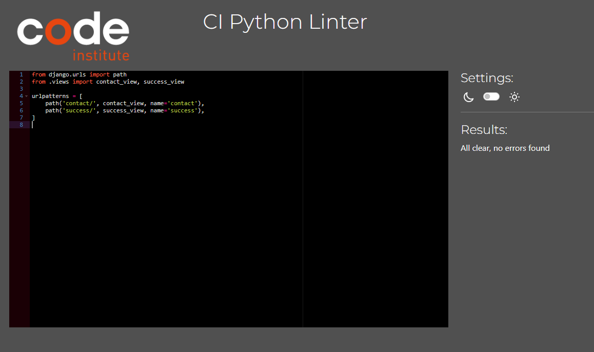

# Irish Craft House


[Link to Live Site](https://irishdesignhousepp5-45c81a68233a.herokuapp.com/)

## Table of Contents

  - [Introduction](#introduction)
  - [User Experience](#user-experience)
    - [User Goals](#user-goals)
    - [Site Owner Goals](#site-owner-goals)
    - [User Stories](#user-stories)
      - [Epic 1: Viewing and navigation](#epic-1:-viewing-and-navigation)
      - [Epic 2: Registration and user accounts](#epic-2:-registration-and-user-accounts)
      - [Epic 3: Sorting and searching](#epic-3:-sorting-and-searching)
      - [Epic 4: Shopping cart management](#epic-4:-shopping-cart-management)
      - [Epic 5: Account management](#epic-5:-account-management)
      - [Epic 6: admin panel functionality](#epic-6:-admin-panel-functionality)
      - [Epic 7: email communication](#epic-7:-email-communication)
  - [Design](#design)
    - [Typography](#typography)
    - [Imagery](#imagery)
    - [Wireframes](#wireframes)
      - [Home page](#home-page)
      - [Products page](#products-page)
  - [Features](#features)
    - [Header](#header)
      - [Navigation bar](#navigation-bar)
    - [Index page](#index-page)
    - [Product Pages](#product-pages)
      - [All products page](#all-products-page)
      - [Product detail page](#product-detail-page)
    - [About Us page](#about-us-page)
    - [Contact Us Page](#contact-us-page)
    - [FAQ Page](#faq-page)
    - [Register/Login/Logout](#register/login/logout)
      - [Register page](#register-page)
      - [Verify Your E-mail Address Page](#verify-your-e-mail-address-page)
      - [Confirm E-mail Address page](#confirm-e-mail-address-page)
      - [Login page](#login-page)
      - [Log Out Page](#log-out-page)
      - [Reset Password Page](#reset-password-page)
      - [Password reset success page](#password-reset-success-page)
      - [Change Password Page](#change-password-page)
      - [Change password Success Page](#change-password-success-page)
    - [Profile Page](#profile-page)
    - [Wishlist Page](#wishlist-page)
    - [Shopping Bag](#shopping-bag)
    - [Checkout page](#checkout-page)
    - [Notifications](#notifications)
    - [Shop Management Features](#shop-management-features)
      - [Product management Page](#product-management-page)
    - [404 error page.](#404-error-page.)
    - [Future Features](#future-features)
  - [Search Engine Optimization (SEO) & Social Media Marketing](#search-engine-optimization-(seo)-&-social-media-marketing)
    - [Keyword Research](#keyword-research)
    - [Metadata](#metadata)
    - [Sitemap](#sitemap)
    - [Robots](#robots)
    - [Social Media Marketing](#social-media-marketing)
  - [Testing](#testing)
    - [Validation of Code](#validation-of-code)
      - [HTML Validation](#html-validation)
      - [CSS Validation](#css-validation)
      - [Python Validation](#python-validation)
        - [about_us](#about_us)
        - [bag](#bag)
        - [checkout](#checkout)
        - [contact](#contact)
        - [faq](#faq)
        - [home](#home)
        - [irish_craft_house](#irish_craft_house)
        - [products](#products)
        - [profiles](#profiles)
        - [wishlist](#wishlist)
    - [Javascript validation](#javascript-validation)
    - [Browser compatibility](#browser-compatibility)
    - [Responsiveness](#responsiveness)
    - [Performance Testing](#performance-testing)
    - [Accessibility Testing](#accessibility-testing)
    - [Lighthouse](#lighthouse)
      - [Desktop](#desktop)
      - [Mobile](#mobile)
    - [Manual Testing](#manual-testing)
      - [Header](#header)
        - [Nav Menu](#nav-menu)
        - [Search Box](#search-box)
        - [My Account Dropdown](#my-account-dropdown)
        - [My Account Dropdown (Logged in shoppers)](#my-account-dropdown-(logged-in-shoppers))
        - [My Account Dropdown (Logged in Admin)](#my-account-dropdown-(logged-in-admin))
        - [Shopping Bag (Logged in Admin)](#shopping-bag-(logged-in-admin))
      - [Index Page](#index-page)
      - [Products Page (Guest shopper and Logged in shopper)](#products-page-(guest-shopper-and-logged-in-shopper))
      - [Products Page (Logged In Admin)](#products-page-(logged-in-admin))
      - [Product Detail Page](#product-detail-page)
      - [Product Detail Page (Logged In Shopper)](#product-detail-page-(logged-in-shopper))
      - [Product Detail Page (Logged In Admin)](#product-detail-page-(logged-in-admin))
      - [About us Page](#about-us-page)
      - [FAQ Page](#faq-page)
      - [Contact us Page](#contact-us-page)
      - [Contact Us Success Page](#contact-us-success-page)
      - [Register/Login/Logout Pages](#register/login/logout-pages)
        - [Register Page](#register-page)
        - [Verify Your E-mail Address Page](#verify-your-e-mail-address-page)
        - [Confirm E-mail Address Page](#confirm-e-mail-address-page)
        - [Login Page](#login-page)
        - [Log Out Page](#log-out-page)
        - [Reset Password Page](#reset-password-page)
        - [Reset Password Page](#reset-password-page)
        - [Reset Password Success Page](#reset-password-success-page)
      - [Profile Page](#profile-page)
      - [Wishlist Page](#wishlist-page)
      - [Shopping Bag](#shopping-bag)
      - [Checkout Page](#checkout-page)
      - [Checkout Success page](#checkout-success-page)
      - [Shop Management Features](#shop-management-features)
        - [Product Management Page](#product-management-page)
      - [404 Error Page Page](#404-error-page-page)
  - [Technologies Used](#technologies-used)
  - [Deployment](#deployment)
    - [Fork repository in GitHub](#fork-repository-in-github)
    - [Clone repository in GitHub](#clone-repository-in-github)
    - [Deployment to Heroku](#deployment-to-heroku)
    - [PostgreSQL from Code Institute Database](#postgresql-from-code-institute-database)
    - [Amazon AWS](#amazon-aws)
      - [S3 Bucket](#s3-bucket)
      - [IAM](#iam)
      - [Final AWS Setup](#final-aws-setup)
  - [Credits](#credits)
    - [Existing projects used for inspiration](#existing-projects-used-for-inspiration)
    - [Bootstrap mega menu -](#bootstrap-mega-menu--)
    - [Wish List Functionality:](#wish-list-functionality:)
    - [FAQ Functionality:](#faq-functionality:)
    - [Contact Us section:](#contact-us-section:)
    - [PP5 project research](#pp5-project-research)
    - [About Us Section:](#about-us-section:)
    - [Website research](#website-research)
  - [Acknowledgements](#acknowledgements)
  - [Addendum](#addendum)
    - [E-Commerce Business Model](#e-commerce-business-model)
    - [Newsletter Marketing](#newsletter-marketing)


## Introduction

The project is an e-commerce website for a shop that offers designer craft items made in Ireland.

Both guests and registered users can explore products and add items to their shopping cart.

Registered users have the ability to place orders, create a wishlist, save their details for future visits, and view their past orders.

## User Experience

### User Goals

The main user goal would be to allow users to browse items easily on the site. The user should be able to view details of chosen items before deciding to buy. They should be able to add or remove items to their shopping basket and change the amount they would like. Users should be able to view and edit details about their account when logged in and change details.

### Site Owner Goals

The site owners main goal would be to be able to have full CRUD (Create, Read, Update, and Delete) functionality for products on the site. They should also be able to edit other content via the admin panel and to communicate with customers via email.

### User Stories

Seven Epics were decided upon with a total of 30 user stories. All user stories can be viewed here [Projects board](https://github.com/users/astro-mat/projects/4/views/1). Each user story was categorized into one of the following classes: Must have, Should have, Could have, or Won't have. Points were given to each user story based on the estimated time required for completion.

| Class | Points | Percentage of total points |
| -------------- | --------- | --------------- |
| Must have | 65 p | 54 % |
| Should have | 51 p | 43 % |
| Could have | 0 p | 0 % |
| Won't have | 4 p | 3 % |

The following user stories were completed in the first release of the Irish craft house website. To view the Won't have, they are listed here [Projects board](https://github.com/users/astro-mat/projects/4/views/1).

#### Epic 1: Viewing and navigation
**User Story - View a list of products**

As a shopper, I can view a list of products so that I can select some to purchase						

Acceptance Criteria 1 - When I navigate to the main product page, I see a grid or list of products.

**User Story - View a specific category of products**

As a shopper, I can view a specific category of products so that I can quickly find products I'm interested in without having to search though all products.						

Acceptance Criteria 1 - Users can find and select from a list of available product categories.

Acceptance Criteria 2 - Only products belonging to the selected category appear in the results.

Acceptance Criteria 3 - The display accurately reflects the category's contents.

**User Story - I can View individual product details**

As a Shopper, I can View individual product details so that I can identify the price, description, product rating, product image and available sizes.

Acceptance Criteria 1 - The product page shows all relevant details such as name, description, price

Acceptance Criteria 2 - High-quality images of the product are presented.

Acceptance Criteria 3 - "Add to Cart" and "Buy Now" buttons are prominently displayed.

**User Story - Quickly identify deals, clearance items and special offers**

As a Shopper, I can Quickly identify deals, clearance items and special offers so that I can take advantage of special savings on products I'd like to purchase.

Acceptance Criteria 1 - Prominent visual indicators for deals and discounts

Acceptance Criteria 2 - Easy-to-access deal listings

Acceptance Criteria 3 - Clear product information about promotions

**User Story - Easily view the total of my purchases at any time**

As a Shopper, Easily view the total of my purchases at any time so that I can avoid spending too much.

Acceptance Criteria 1 - The total is displayed prominently and updates in real-time as purchases are made.

Acceptance Criteria 2 - Shopper	find out information about the organisation	Decide if I like this company and what they stand for

Acceptance Criteria 3 - An "About Us" or similar section is prominently linked in the footer or header of every page.

**User Story - find answers to questions I may have**

As a Shopper, find answers to questions I may have so that I can be more informed before I decide to purchase.

Acceptance Criteria 1 - A dedicated FAQ page is easily accessible from the main navigation menu.

#### Epic 2: Registration and user accounts	

**User Story - Easily register for an account**

As a Site User, easily register for an account so that I can have a personal account and be able to view my profile.

Acceptance Criteria 1 - The registration form is concise and requires minimal information.

Acceptance Criteria 2 - The registration form submits promptly without unnecessary delays.

Acceptance Criteria 3 - After successful registration, users are shown a confirmation message.
							
**User Story - Easily login or logout**

As a Site User, easily login or logout so that I can access my personal account information.

Acceptance Criteria 1 - The login form is easily accessible and prominently displayed.

Acceptance Criteria 2 - Users receive immediate confirmation of successful login or logout.

Acceptance Criteria 3 - The interface clearly indicates whether the user is logged in or logged out.

**User Story - Easily recover my password in case I forget it**

As a Site User, easily recover my password in case I forget it so that I can recover access to my account.

Acceptance Criteria 1 - A clear "Forgot Password" link is visible on the login page.

Acceptance Criteria 2 - The system sends a password reset link to the registered email address.

Acceptance Criteria 3 - Upon successful password reset, users are notified and redirected to the login page.

**User Story - receive an Email confirmation after registering**

As a Site User, receive an Email confirmation after registering so that I can verify that my account registration was successful.

Acceptance Criteria 1 - An email is automatically sent to the registered email address immediately after registration.

Acceptance Criteria 2 - The subject line clearly indicates it's a confirmation email.

Acceptance Criteria 3 - The email is sent promptly after successful registration.

**User Story - have a personalised user profile**

As a Site User, have a personalised user profile so that I can view my personal order history and order confirmation and save my payment information..

Acceptance Criteria 1 - Users can quickly access their profile from a dedicated menu item.

Acceptance Criteria 2 - Users can edit and update their personal details through the profile page.

Acceptance Criteria 3 - Users can manage their account settings, notification preferences, and privacy options.

**User Story - Can access Emails sent via the website**

As an admin, I Can access Emails sent via the website so that I can see what emails have been sent via the website.

Acceptance Criteria 1 - Administrators have a dedicated section to view all emails sent through the website.

Acceptance Criteria 2 - Email logs include sender, recipient, subject, and timestamp.
							                                
**User Story - **

As a Shopper, contact the website admin so that I can ask any questions that I need to ask.

Acceptance Criteria 1 - A prominent "Contact" link or button is visible on the website.

Acceptance Criteria 2 - The contact form is simple and easy to fill out.

Acceptance Criteria 3 - Users receive immediate confirmation of form submission.		
                                    
                                    
**User Story - **

As a Shopper, I can add items to a wish list so that I can Decide weather or not to buy it later.

Acceptance Criteria 1 - A dedicated "Add to Wish List" button is visible on product pages.

Acceptance Criteria 2 - Items are immediately added to the user's wish list when clicked.

Acceptance Criteria 3 - Users can easily access and view their wish list from a dedicated page.	
                                    
#### Epic 3: Sorting and searching	    

**User Story - sort the list of available products**

As a Shopper, sort the list of available products so that I can easily identify the best rated, best priced and categorically sorted products.

Acceptance Criteria 1 - Users can sort products by at least three criteria: best-rated and category.

Acceptance Criteria 2 - Sorting options are clearly visible and easily selectable.

Acceptance Criteria 3 - The sorted list updates immediately when a new sorting option is chosen.
                                    
**User Story - sort a specific category of product**
                                    
As a Shopper, I can sort a specific category of product so that I can find the best-priced or best-rated product in a specific category or sort the products in that category by name.

Acceptance Criteria 1 - Sorting directions (ascending/descending) are provided for each option.

Acceptance Criteria 2 - Users can easily see which sorting criterion is being applied at any given time.

                             
**User Story - sort multiple categories of products simultaneously**
                                    
As a Shopper, I can sort multiple categories of products simultaneously so that I can find the best-priced or best-rated products across broad categories such as "homewares" or "Jewellery".

Acceptance Criteria 1 - Users can select multiple categories to sort together.

Acceptance Criteria 2 - The sorting algorithm applies the chosen criteria uniformly across all selected categories.

Acceptance Criteria 3 - Users can easily see the combined result of their selections.					
                                    
**User Story - I can search by a product name or description**
                                    
As a Shopper, I can search by a product name or description so that I can find a specific product I'd like to purchase.

Acceptance Criteria 1 - Users can search for products using both exact matches and partial matches of names and descriptions.

Acceptance Criteria 2 - A prominent search bar is easily accessible on product pages and the main site.


**User Story - **
                                    
As a Shopper, I can easily see what I've searched for and the number of results so that I can quickly see whether the product I want is available.

Acceptance Criteria 1 - The number of results found is prominently displayed near the search box.

Acceptance Criteria 2 - A list of search results is shown on the search results page.

#### Epic 4: Shopping cart management
                                    
**User Story - Add items to shopping cart**
                                    
As a Shopper, I can Add items to shopping cart so that I can Purchase the items at the same time.

Acceptance Criteria 1 - Clicking the "Add to Cart" button adds the item to the cart.

Acceptance Criteria 2 - The cart icon displays the number of items in the cart.

Acceptance Criteria 3 - The cart total updates automatically after adding items
    							
                                    
**User Story - Remove items from shopping cart**
                                    
As a Shopper, I can Remove items from shopping cart so that I can reduce the selection of items that I want to buy.

Acceptance Criteria 1 - Clicking the "Remove" button removes the item from the cart.

Acceptance Criteria 2 - The cart icon updates to reflect the new item count.

Acceptance Criteria 3 - The cart total adjusts accordingly after removing items.
                                    
        							
**User Story - Change quantity in shopping cart**
                                    
As a shopper, I can Change quantity in shopping cart so that I can change how many of individual items I wish to purchase.

Acceptance Criteria 1 - Entering a value in the quantity field updates the cart total.

Acceptance Criteria 2 - Clicking "Update" applies the quantity change.

Acceptance Criteria 3 - The cart displays the updated quantity and price.

#### Epic 5: Account management	                            
                                    
**User Story - View account details**
                                    
As a Logged in user, I can View account details so that I can check if they are correct.

Acceptance Criteria 1 - My profile information is displayed on the account page.

Acceptance Criteria 2 - All order history is visible.

Acceptance Criteria 3 - My saved addresses and payment methods are accessible.


**User Story - Edit account details**
                                    
As a Logged in user, I can Edit account details so that I can make changes if they need to be made.

Acceptance Criteria 1 - I can update my name, email, and password

Acceptance Criteria 2 - Changes are reflected immediately upon saving

Acceptance Criteria 3 - Error messages are displayed for invalid inputs
    								
#### Epic 6: admin panel functionality
                     
**User Story - Create products**
                                    
As an admin, I can create products so that I can sell new products on the site.

Acceptance Criteria 1 - I can add product name, description, price, and images

Acceptance Criteria 2 - Categories and tags can be assigned to products

Acceptance Criteria 3 - Product creation is confirmed with a success message
    								
                                    
**User Story - Update product details**
                                    
As an admin, I can update product details so that I can make changes to products when they change.

Acceptance Criteria 1 - I can modify product name, description, price, and images

Acceptance Criteria 2 - Category and tag assignments can be changed

Acceptance Criteria 3 - Updated product information is reflected immediately
        						
    					
**User Story - Remove products from the site**
                                    
As an admin, I can remove products from the site so that I can remove them when they become non-stock items.

Acceptance Criteria 1 - Deleting a product removes it from the catalog

Acceptance Criteria 2 - Associated orders are marked as canceled

Acceptance Criteria 3 - A confirmation message is displayed after deletion

#### Epic 7: email communication
								
**User Story - Send order confirmation emails**
                                    
As an admin , I can Send order confirmation emails so that I can confirm to the customer that an order has been received.

Acceptance Criteria 1 - Emails are sent automatically after successful checkout

Acceptance Criteria 2 - Order details are included in the email

Acceptance Criteria 3 - Recipients can easily access their order status
                                    
        						
**User Story - send automated password reset emails**
                                    
As an admin, I can send automated password reset emails so that I can allow users to use the logged in functions automatically in the event of password loss.

Acceptance Criteria 1 - Emails are sent automatically when a password reset request is made

Acceptance Criteria 2 - Reset link is valid for a limited time

Acceptance Criteria 3 - Password reset is confirmed via email after successful change

## Design

The website was designed with a clean, simple look to reflect the quality design aspect of the brand. Simple black and white colour scheme was chosen which supported this choice and provided high contrast.

### Typography

The typography was chosen to fit in with the design style established by the colour choices earlier while still being easy to read. Capitalisation was employed for titles to re-enforce this design choice.

### Imagery

High quality imagery was important as it signals to prospective customers what they can expect. Wherever possible, lifestyle images are used to re-enforce the brand

### Wireframes
Wireframes were made using [Balsamiq](https://balsamiq.com/) of the home page and products page. 

#### Home page


#### Products page


## Features

### Header

#### Navigation bar


- The navigation bar makes it easy for the user to navigate the site. 
- The navbar is fixed to the top of all pages to allow easy navigation
- The Navbar contains dropdown menus to browse the shop, the website logo and a search bar
- The shop dropdown shows links to all the product categories


- There is a "My Account" dropdown which looks different depending on the user

A non logged in user sees an option to either register or login


A logged in shopper sees a link to view their profile, to view wish-lists and to logout


A logged in admin level user sees the same but with the addition of a product management link


### Index page


- The index page is dominated by the hero image is a simple lifestyle shot which conforms to the overall theme of the site. Over the top of this is a bold statement for the webshop and contains core keywords for SEO purposes
- This section provides the user with a clear visual opening to the site and what to expect
- Below the statement is a call to action button inviting the user to "SHop Now" and enter the main shop

### Product Pages

#### All products page

- The all products page is arrived at after the main call to action button on the hero image.


- There is a drop down filter menu to allow the user to filter the displayed products by various different categories.


- A logged in admin user sees the same information, except for the options to edit or delete each product.


#### Product detail page

- When product is clicked, the user is taken to the product detail page
- A more detailed description of the selected product is displayed
- Buttons to add the item to the basket or to the wishlist are displayed together with a quantity box to select how many of the items the user would like to purchase.


- A logged in Admin user again sees the option to edit or delete the product


### About Us page

- The about us page gives a short description of the histary and background of company and website
- A "Back To shop" allows users to easily navigate to the main shop page


### Contact Us Page

- The contact us page allows the user to contact the admin
- The user enters name, email and a message. Form validation is present. A button allows the message to be sent
- Once sent, a message is sent to the admin email address and a confirmation is sent to the user. The message is also available in the website admin.
- The page also provides all the proposed social links for the website
- After the message is sent, the user is re-directed to the "contact us" success page. THe user is invited to return to the main shop via the "Keep Shopping" button


### FAQ Page

- The FAQ page allows the admin to convey information taht is often asked to the user.
- The questions and answers can be edited from the admin panel by the admin user.
- There is a "Keep shopping" button to take the user back to the shopping page


### Register/Login/Logout

- Users are required to sign in in order to make a purchase on the site
- After signing up, users need to verify their account by clicking the link in the welcome email.
- New users can choose either to login if they already have an account, or register if they do not

#### Register page

- The new user is invited to enter details in order to create an account
- Form has full validation error checking. 
- A notice states that if the user already have an account, Then please sign in. A link is provided for this (See below)
- Once a user registers, they are sent a confirmation email with a link that needs to be clicked to allow login


#### Verify Your E-mail Address Page

- After registering for an account, the user reaches this page instructing them to check emails for a confirmation
- The Email contains a link to Confirm E-mail Address.


#### Confirm E-mail Address page

- The user can select a button that confirms the email.
- They are then taken to the Login page where they can now login


#### Login page

- If the user has an existing account, they can enter their details here to login
- There is an option to "Remember me" so that the user can chose to not have to enter their details in future sessions
- A link is provided for if the user has forgotten their password (See below)
- Once successfully signed in, they are taken to the index page


#### Log Out Page

- A simple page that the user can either choose to logout with (via button)
- If the user changes their mind, they can select "Cancel"
- Both options take the user to the index page


#### Reset Password Page

- The user is prompted to enter email address
- Once Email is entered and "Reset my password" button is pressed, an email is sent to the email address with further instructions
- The user can also choose to go back to login page if they realise that they have remembered their password.


#### Password reset success page

- Once the email has been entered on Reset Password Page and submitted, the user is taken to this page.
- The user is asked to check their email
- The email contains a link
- The link leads to the change password page


#### Change Password Page

- The user is invited to change there password
- Warnings are given if the new password does not pass the validation


#### Change password Success Page

- This page simply informs the user that there password has been changed
- They can now login with their new password


### Profile Page

- This page is accessed from the "My Account" Dropdown in the main header 
- The user can update their address and phone number
- The page also displays their order history listing any orders they have made, order number, date, items and total cost.


### Wishlist Page

- If items are added to the users wishlist, they can be viewed here.
- A simple summary of all the items in the users wishlist is displayed including item description, item image.
- Each item has buttons that can add the item to the shopping bag or remove from the wishlist


### Shopping Bag

- This page displays a list of all the items that the user has selected to be eventually purchased.
- Each product is listed in a table with its image, description, size (If applicable), SKU, price, quantity and sub total
- The quantity can be increased or decreased
- the item can be removed if desired
- At the bottom is a total, a calculated shipping charge and a grand total
- The user is then invited to either keep shopping (Back to products page) or continue to checkout


### Checkout page

- Here, the user can fill in their name and shipping address
- an option is included to Save this delivery information to the users profile
- An order summary is displayed detailing an image, description, size (If applicable), SKU, price, quantity and sub total
- At the bottom is a total, a calculated shipping charge and a grand total
- Payment details are to be entered before purchase can be made
- Buttons are included which invite the user to either go back and adjust the bag contents or complete the order


### Notifications

- Notifications are given to the user for all significant events on the website.

### Shop Management Features

- There are several features of the website that are only accessible to logged in users with admin rights
- Staff users can only be created within the Django Admin panel

#### Product management Page

- Here a user can add a product by entering in the details and choosing an image
- Only valid entries are allowed otherwise a warning notification is issued
- The page is accessed via the "My Account" Drop down menu (Logged in staff users only)
- The page is also accessed when either "Edit" or "Delete" is clicked on any product. When this happens, the page is populated with the details of the relevant product
- For more detailed editing features, the user can log into the Django admin interface


### 404 error page.

- Custom 404 error page is included to appear when the website won't load.


### Future Features

Several features can be added in the future.

- Add more content to home page.
- Add footer to home page
- Special offers and clearance menu items
- more text on home page for better SEO results
- footer to include social links
- Hero image could be upgraded to an image slider
- More products - Can be done by client
- No items in deals and clearance
- Wishlist could allow for quantities. It could also include and add to bag button
- Add more functionality to the wishlist page. Ability to change quantity, better layout to more closely match the shopping bag design, add to bag feature.
- Improvements to the accessibility as detailed in [Accessibility Testing](#accessibility-testing).

## Search Engine Optimization (SEO) & Social Media Marketing

### Keyword Research

To enhance Google search index ratings, various tools were utilised, including Moz and QuestionDB, to identify relevant keywords for incorporation into meta tags, alt-text descriptions, and content elements of the project.

The first step was to brainstorm general topics and keywords; 
**General Handmade Craft Items**
- Handmade crafts
- Unique handmade items
- Artisan goods
- Handcrafted products
- Irish handmade crafts
- Celtic crafts
- Traditional Irish crafts
**Specific Categories**
- Handmade jewellery
- Knitted items
- Woodcarvings
- Pottery
- Textiles
- Glasswork
- Metalwork
- Leathercraft
- Ceramics
- Embroidery
**Seasonal/Holiday-Themed Crafts**
- Christmas ornaments
- Easter decorations
- Halloween accessories
- St. Patrick's Day gifts
- Valentine's Day crafts
- Summer garden decor
- Autumn-themed crafts
**Irish-Themed Crafts**
- Shamrock designs
- Celtic knot patterns
- Leprechaun figurines
- Claddagh rings
- Irish heritage crafts
- Celtic cross jewelry
- Triskelion symbols
**Long-Tail Keywords**
- Handmade Irish wool scarves
- Customizable Celtic-inspired jewelry
- Hand-painted Irish pottery
- Hand-knitted Aran sweaters
- Handmade Irish crystal jewelry
- Hand-carved wooden Irish flutes
- Handmade Irish linen table runners

These were then assessed for relevance and authoritativeness.

**Relevance Assessment**
- General keywords: Highly relevant
    Terms like "handmade crafts," "artisan goods," and "unique handmade items" directly relate to the website's offerings.
- Specific categories: Moderately relevant
    While specific categories like "knitted items" or "woodcarings" are relevant, they might be too broad for SEO purposes.
- Seasonal/holiday-themed crafts: Relevant but limited
    These keywords are seasonal and may have limited long-term impact.
- Irish-themed crafts: Very relevant
    Keywords like "Celtic crafts" and "Irish heritage crafts" are highly relevant to the target audience.
- Long-tail keywords: Most relevant
    These specific product descriptions are highly targeted and likely to attract relevant traffic.
**Authoritativeness Assessment**
- General terms: Good foundation
    Using authoritative terms like "handmade crafts" establishes credibility.
- Specific categories: Limited authority
    While specific categories exist, they don't necessarily convey expertise.
- Irish-specific terms: Strong authority
    Terms like "Irish heritage crafts" suggest deep knowledge of Irish craft traditions.
- Long-tail keywords: Strong authority
    These specific product descriptions demonstrate expertise in particular craft types.

Based on this, the top keywords could be identified:

- Handmade Irish crafts
- Unique Celtic-inspired jewellery
- Traditional Irish pottery
- Hand-knitted Aran sweaters
- Customizable Irish crystal jewellery
- Hand-carved wooden Irish flutes
- Handmade Irish linen table runners
- Shamrock designs
- Claddagh rings
- Irish heritage crafts


**General steps to improve SEO Results**
based on this research base.html and index.html were changed in order to better represent the identified keywords. The main logo was changed from a H1 tag to a span so that our H1 could be used in the hero image with two of our identified keywords.


### Metadata
I included Metadata to help with SEO results. Keywords, description and title were all used as opportunities to improve SEO.

### Sitemap

I've used [XML-Sitemaps](https://www.xml-sitemaps.com) to generate a sitemap.xml file.
This was generated using my deployed site URL: https://irishdesignhousepp5-45c81a68233a.herokuapp.com/

After it finished crawling the entire site, it created a
[sitemap.xml](sitemap.xml) which I've downloaded and included in the root of the repository.

### Robots

I've created the [robots.txt](robots.txt) file at the root-level.
Inside, I've included the settings:

```
User-agent: *
Disallow: /profile/
Disallow: /bag/
Sitemap: https://irishdesignhousepp5-45c81a68233a.herokuapp.com/sitemap.xml
```

Further links for future implementation:
- [Google search console](https://search.google.com/search-console)
- [Creating and submitting a sitemap](https://developers.google.com/search/docs/advanced/sitemaps/build-sitemap)
- [Managing your sitemaps and using sitemaps reports](https://support.google.com/webmasters/answer/7451001)
- [Testing the robots.txt file](https://support.google.com/webmasters/answer/6062598)

### Social Media Marketing

I included links in on the contact page which could be used for potential Facebook, Twitter, Instagram and TikTok presences for the business.

I've created a mockup Facebook business account using the
[Balsamiq template](https://code-institute-org.github.io/5P-Assessments-Handbook/files/Facebook_Mockups.zip)
provided by Code Institute.


For this business I envision a lot of the social media marketing being very visual, using the current most popular formats like Instagram Reels and TikTok. As these are primarily video based I did not mock any for the purposes of this coding project.

Further keywords additions are limited here due to the lack of text on our home page. Future improvements of the site would be to include more text. Keywords were included in the about us text. This text can be edited by the shop editors if they feel they need to.

Future additions could also include external links to further improve our SEO results.

Further improvements could be made to the images on the site. Currently, they are all named after the stock code of the item. This is not helpful for search engine optimisation. WOrk could be done in renaming these to more meaningful descriptions of the items. Also, there is no allowance for alt tags and this should be added in future versions.

The Meta data does not yet include an image to be displayed when the site is shared on social media

## Testing

### Validation of Code

#### HTML Validation


All the pages were tested at the [W3C Markup Validation Service](https://validator.w3.org/). The index page validation is above, all the other validations are linked below.

- [Add product page](docs/images/add-product-valid.PNG)
- [Edit Product page](docs/images/edit-product-valid.PNG)
- [Product Detail page](docs/images/product-detail-valid.PNG)
- [Product page](docs/images/product-page-valid.PNG)
- [FAQ page](docs/images/faq-page-valid.PNG)
- [Contact us page](docs/images/contact-us-valid.PNG)
- [Contact Success](docs/images/contact-success-valid.PNG)
- [Profile Page](docs/images/profile-page-valid.PNG)
- [Sign up Page](docs/images/sign-up-html-valid.PNG)
- [Login Page](docs/images/register-html-valid.PNG)
- [Log Out Page](docs/images/log-out-html-valid.PNG)
- [Password Reset Page](docs/images/password-reset-html-valid.PNG)
- [Wishlist Page](docs/images/wishlist-valid.PNG)


#### CSS Validation

The CSS code was tested at [W3C CSS Validation Service](https://jigsaw.w3.org/css-validator/). The process completed without errors.

**base.css**


**contact.css**


**profile.css**


#### Python Validation

All Python files have been validated using the [CI Python Linter](https://pep8ci.herokuapp.com/) to ensure they meet PEP8 standards. The validation process completed without any errors.

##### about_us

**about us - views.py**


**about us - models.py**


**about us - admin.py**


**about us - urls.py**


**about us - apps.py**


##### bag

**bag - views.py**


**bag - urls.py**


**bag - apps.py**


##### checkout

**checkout - views.py**


**checkout - models.py**


**checkout - admin.py**


**checkout - forms.py**


**checkout - urls.py**


**checkout - apps.py**


**checkout - webhook_handler.py**


**checkout - webhooks.py**


##### contact

**contact - views.py**


**contact - models.py**


**contact - admin.py**


**contact - forms.py**


**contact - urls.py**



**contact - apps.py**


##### faq

**faq - views.py**


**faq - models.py**


**faq - admin.py**


**faq - urls.py**


**faq - apps.py**


##### home

**home - views.py**


**home - urls.py**


**home - apps.py**


##### irish_craft_house

**irish_craft_house - views.py**


**irish_craft_house - urls.py**


**irish_craft_house - settings.py**


**irish_craft_house - wsgi.py**


##### products

**products - views.py**


**products - models.py**


**products - admin.py**


**products - forms.py**


**products - urls.py**


**products - apps.py**


##### profiles

**profiles - views.py**


**profiles - models.py**


**profiles - forms.py**


**profiles - urls.py**


**profiles - apps.py**


##### wishlist

**wishlist - views.py**


**wishlist - models.py**


**wishlist - forms.py**


**wishlist - urls.py**


**wishlist - apps.py**


### Javascript validation

All Javascript files have been validated using the [Javascript Linter](https://jshint.com/) to ensure they meet PEP8 standards. The validation process completed without any errors.

**stripe_elements.js**

The linter listed stripe as an unknown variable here. As it is coming from another script, this warning can be ignored


**countryfield.js**


 
### Browser compatibility

I tested the website on four different operating systems on four different types of hardware and didn't find any rendering bugs or unexpected behaviour between the browsers tested.

| Operating System | Chrome | Firefox | Edge | Safari |
|------------------|--------|---------|------|--------|
| macOS 13.2       | ✅      | ✅       | ✅    | ✅   |
| Windows 11       | ✅      | ✅       | ✅    | N/A   |
| Android 10       | ✅      | ✅       | ✅    | ✅   |
| iOS & iPadOS 16.3  | N/A   | N/A       | N/A   | ✅   |

### Responsiveness

I tested for responsiveness on many different sized viewports from 320px wide up to Ultrawide resolutions, and using different hardware (Monitors, Laptops, Phones). No rendering bugs or unexpected behaviour between the sizes was noticed.

I used [Polypane](https://polypane.app/) during development to test many different viewport sizes at once.

### Accessibility Testing 

The website was tested with the [WAVE Web Accessibility Evaluation Tool](https://wave.webaim.org/report#/https://irishdesignhousepp5-45c81a68233a.herokuapp.com/).

Minimal errors were found. Future versions of the site could add labels to the search bar and deal with the empty button issue to solve these

WAVE Web Accessibility Evaluation Tool Results


Accessibility could be improved in the future with the addition of a text box behind the text as in the following version ;


### Lighthouse

Tests in Lighthouse were performed for both desktop and mobile.

#### Desktop


The test for desktop resulted in scores all over 90.

#### Mobile


The test for mobile resulted in scores all over 90 except for the best practices which scored 74. I am confident that this could be easily improved particularly by paying attention to the use of cookies on the site

### Manual Testing

Every page at the website has been manually tested. It is done in Google Chrome DevTools and on different devices. The devices used were one mobile phone, one laptop and one external screen:

- Samsung Galaxy A52s (1080 x 2400)
- HP 250 G4 Notebook PC (1366 x 768)
- HP 2309v LCD Screen (1920 x 1080)

#### Header
| Feature being tested | Expected Outcome | Testing Performed | Actual Outcome | Result (Pass or fail) |
| -------------------- | ---------------- | ----------------- | -------------- | --------------------- |
| Home/logo link | When clicked, directs the user to the home page | Click at "Home" | Got directed to the home page | Pass |

##### Nav Menu
| Feature being tested | Expected Outcome | Testing Performed | Actual Outcome | Result (Pass or fail) |
| -------------------- | ---------------- | ----------------- | -------------- | --------------------- |
| Shop drop-down | When clicked, dropdown appears with further links to product categories | Click at "SHOP" | Dropdown appeared | Pass |
| Products link | When clicked, directs the user to a filtered list of all products | Click at "products" | Got directed to a filtered list of all products | Pass |
| By Price link | When clicked, directs the user to a filtered list of By Price | Click at "By Price" | Got directed to a filtered list of By Price | Pass |
| By Rating link | When clicked, directs the user to a filtered list of By Rating | Click at "By Rating" | Got directed to a filtered list of By Rating | Pass |
| By Category link | When clicked, directs the user to a filtered list of By Category | Click at "By Category" | Got directed to a filtered list of By Category | Pass |
| All Products link | When clicked, directs the user to a filtered list of all products | Click at "All products" | Got directed to a filtered list of all products | Pass |
| Jewellery link | When clicked, directs the user to a filtered list of Jewellery | Click at "Jewellery" | Got directed to a filtered list of All Jewellery | Pass |
| Pendants & Earings link | When clicked, directs the user to a filtered list of Pendants & Earings | Click at "Pendants & Earings" | Got directed to a filtered list of Pendants & Earings | Pass |
| Cufflinks, Tie clips & Lapel Pins link | When clicked, directs the user to a filtered list of Cufflinks, Tie clips & Lapel Pinss | Click at "Cufflinks, Tie clips & Lapel Pins" | Got directed to a filtered list of Cufflinks, Tie clips & Lapel Pins | Pass |
| All Jewellery link | When clicked, directs the user to a filtered list of Jewellery | Click at "All Jewellery" | Got directed to a filtered list of All Jewellery | Pass |
| Baby & Kids link | When clicked, directs the user to a filtered list of Baby & Kids | Click at "Baby & Kids" | Got directed to a filtered list of Baby & Kids | Pass |
| Skincare link | When clicked, directs the user to a filtered list of Skincare | Click at "Skincare" | Got directed to a filtered list of Skincare | Pass |
| Face, Body, Bath & Balms link | When clicked, directs the user to a filtered list of Face, Body, Bath & Balms | Click at "Face, Body, Bath & Balms" | Got directed to a filtered list of Face, Body, Bath & Balms | Pass |
| Soap & Shaving Soaps link | When clicked, directs the user to a filtered list of Soap & Shaving Soaps | Click at "Soap & Shaving Soaps" | Got directed to a filtered list of Soap & Shaving Soaps | Pass |
| All Skincare link | When clicked, directs the user to a filtered list of Skincare | Click at "All Skincare" | Got directed to a filtered list of Skincare | Pass |
| Unique Pieces link | When clicked, directs the user to a filtered list of Unique Pieces | Click at "Unique Pieces" | Got directed to a filtered list Unique Pieces | Pass |
| Prints & Books link | When clicked, directs the user to a filtered list of Prints & Books | Click at "Prints & Books" | Got directed to a filtered list Prints & Books | Pass |
| Bags link | When clicked, directs the user to a filtered list of Bags | Click at "Bags" | Got directed to a filtered list Bags | Pass |

##### Search Box
| Feature being tested | Expected Outcome | Testing Performed | Actual Outcome | Result (Pass or fail) |
| -------------------- | ---------------- | ----------------- | -------------- | --------------------- |
| Search Box | When clicked, redirects to item in text box | Search for known item | Got directed to desired item | Pass | 
| Search Box | When clicked, redirects to item in text box | Search for keyword item | Got directed to list of items containing keyword | Pass | 

##### My Account Dropdown
| Feature being tested | Expected Outcome | Testing Performed | Actual Outcome | Result (Pass or fail) |
| -------------------- | ---------------- | ----------------- | -------------- | --------------------- |
| My account dropdown | The menu drops down | Click on the Button | The menu dropped down | Pass |
| Register link | The link takes me to the Register page | Click on link | Link takes user to the Register page | Pass |
| Login Link |  The link takes me to the Login page | Click on link | Link takes user to the Login page | Pass |

##### My Account Dropdown (Logged in shoppers)
| Feature being tested | Expected Outcome | Testing Performed | Actual Outcome | Result (Pass or fail) |
| -------------------- | ---------------- | ----------------- | -------------- | --------------------- |
| View Wishlist Link | The link takes me to the Wishlist page | Click on link | Link takes user to the Wish page | Pass |
| The Log-out Link | The link takes me to the Logout page page | Click on link | Link takes user to the Wish page | Pass |
| Log-Out | Loose access to logged in content | Click on log-out link | Lost access to logged in content | Pass |
| Log-Out | Redirect to Log-Out Page | Click on log-out link | Redirected to Log-Out Page | Pass | 
| Log-Out | Toast notification that you have logged out | Click on log-out link | Toast notification is visible | Pass |

##### My Account Dropdown (Logged in Admin)
| Feature being tested | Expected Outcome | Testing Performed | Actual Outcome | Result (Pass or fail) |
| -------------------- | ---------------- | ----------------- | -------------- | --------------------- |
| Product Management Link | The link takes me to the Wishlist page | Click on link | Link takes user to the Wish page | Pass |

##### Shopping Bag (Logged in Admin)
| Feature being tested | Expected Outcome | Testing Performed | Actual Outcome | Result (Pass or fail) |
| -------------------- | ---------------- | ----------------- | -------------- | --------------------- |
| Shopping Bag Link | The link takes me to the Shopping Bag page | Click on link | Link takes user to the Shopping Bag | Pass |

#### Index Page
| Feature being tested | Expected Outcome | Testing Performed | Actual Outcome | Result (Pass or fail) |
| -------------------- | ---------------- | ----------------- | -------------- | --------------------- |
| Responsive design | The page changes so the content fit at the smallest to the largest screens without scrolling sideways | In DevTools, select the smallest device and make it larger step by step | The index page was responsive and changed depending on screen size | Pass |
| "Shop Now" button | Directs the user to the "Shop Now" page | Click at the "Shop Now" button | Got directed to the Shop Now page | Pass |
| Text readability | Enough margins and padding to make text readable | Read all text blocks at all different Bootstrap breakpoints | The text is readable at all breakpoints | Pass |

#### Products Page (Guest shopper and Logged in shopper)
| Feature being tested | Expected Outcome | Testing Performed | Actual Outcome | Result (Pass or fail) |
| -------------------- | ---------------- | ----------------- | -------------- | --------------------- |
| Responsive design | The page changes so the content fit at the smallest to the largest screens without scrolling sideways | In DevTools, select the smallest device and make it larger step by step | The page was responsive and changed depending on screen size | Pass |
| Text readability | Enough margins and padding to make text readable | Read all text blocks at all different Bootstrap breakpoints | The text is readable at all breakpoints | Pass |
| Redirected after clicking on a product | When user clicks on product image, the user gets redirected to the product detail Page  | CLick on product image | The user got redirected to Product detail page | Pass |
| Sort by... Function Price (Low to high) | Select the option and page filters product list accordingly | Click on the option | Pages features the correct filtered list | Pass |
| Sort by... Function Price (high to Low) | Select the option and page filters product list accordingly | Click on the option | Pages features the correct filtered list | Pass |
| Sort by... Function Price (Low to High) | Select the option and page filters product list accordingly | Click on the option | Pages features the correct filtered list | Pass |
| Sort by... Rating (high to Low) | Select the option and page filters product list accordingly | Click on the option | Pages features the correct filtered list | Pass |
| Sort by... Rating (Low to High) | Select the option and page filters product list accordingly | Click on the option | Pages features the correct filtered list | Pass |
| Sort by... Name (A-Z) | Select the option and page filters product list accordingly | Click on the option | Pages features the correct filtered list | Pass |
| Sort by... Name (Z-A) | Select the option and page filters product list accordingly | Click on the option | Pages features the correct filtered list | Pass |
| Sort by... Category (A-Z) | Select the option and page filters product list accordingly | Click on the option | Pages features the correct filtered list | Pass |
| Sort by... Category (Z-A) | Select the option and page filters product list accordingly | Click on the option | Pages features the correct filtered list | Pass |

#### Products Page (Logged In Admin)
| Feature being tested | Expected Outcome | Testing Performed | Actual Outcome | Result (Pass or fail) |
| -------------------- | ---------------- | ----------------- | -------------- | --------------------- |
Edit Product Redirect| When the "Edit" button is pressed, User is redirected to Product Management Page | Visit Product Page, Select a item to edit, Click "Edit" | The user got redirected to Product Management Page for that item | Pass |
Delete Product |  When the "Delete" button is pressed, User is redirected to Product Management Page | Visit Product Page, Select a booking to delete, Click "Delete" | The user got redirected to Product Management Page for that item | Pass |

#### Product Detail Page
| Feature being tested | Expected Outcome | Testing Performed | Actual Outcome | Result (Pass or fail) |
| -------------------- | ---------------- | ----------------- | -------------- | --------------------- |
| Quantity Button | Changes the quantity desired before adding to the bag | Click on "+" "&" - buttons | Quantity changed in increments up and down | Pass |
| "Keep Shopping" button | Re-Directs user back to the "All Products" Page | Click on the "Keep Shopping" Button | Re-directed to the "All Products" Page | Pass |
| "Add to Bag" button | Adds item to the shopping bag | Click on the "Add to Bag" Button | Item is added to the shopping bag | Pass |
| "Add to Bag" Notification | Notification pops up indicating item is added to the shopping bag | Click on the "Add to Bag" Button | Notification pops up indicating item is added to the shopping bag | Pass |
| "Add to Bag" Notification | Notification shows updated contents of shopping bag and total cost | Click on the "Add to Bag" Button | Notification pops up showing updated contents of shopping bag and total cost | Pass |


#### Product Detail Page (Logged In Shopper)
| Feature being tested | Expected Outcome | Testing Performed | Actual Outcome | Result (Pass or fail) |
| -------------------- | ---------------- | ----------------- | -------------- | --------------------- |
| "Wishlist" button | Adds item to the wishlist | Click on the "Wishlist" Button | Item is added to the wishlist | Pass |
| "Wishlist" Notification | Notification pops up indicating item is added to the wishlist | Click on the "Wishlist" Button | Notification pops up indicating item is added to the wishlist | Pass |

#### Product Detail Page (Logged In Admin)
| Feature being tested | Expected Outcome | Testing Performed | Actual Outcome | Result (Pass or fail) |
| -------------------- | ---------------- | ----------------- | -------------- | --------------------- |
Edit Product Redirect| When the "Edit" button is pressed, User is redirected to Product Management Page | Visit Product Page, Select a item to edit, Click "Edit" | The user got redirected to Product Management Page for that item | Pass |
Delete Product |  When the "Delete" button is pressed, User is redirected to Product Management Page | Visit Product Page, Select a booking to delete, Click "Delete" | The user got redirected to Product Management Page for that item | Pass |

#### About us Page
| Feature being tested | Expected Outcome | Testing Performed | Actual Outcome | Result (Pass or fail) |
| -------------------- | ---------------- | ----------------- | -------------- | --------------------- |
| Back to shop Button | Re-Directs user back to the "All Products" Page | Click on the "Keep Shopping" Button | Re-directed to the "All Products" Page | Pass |
| Responsive design | The page changes so the content fit at the smallest to the largest screens without scrolling sideways | In DevTools, select the smallest device and make it larger step by step | The page was responsive and changed depending on screen size | Pass |
| Text readability | Enough margins and padding to make text readable | Read all text blocks at all different Bootstrap breakpoints | The text is readable at all breakpoints | Pass |

#### FAQ Page
| Feature being tested | Expected Outcome | Testing Performed | Actual Outcome | Result (Pass or fail) |
| -------------------- | ---------------- | ----------------- | -------------- | --------------------- |
| Back to shop Button | Re-Directs user back to the "All Products" Page | Click on the "Keep Shopping" Button | Re-directed to the "All Products" Page | Pass |
| Responsive design | The page changes so the content fit at the smallest to the largest screens without scrolling sideways | In DevTools, select the smallest device and make it larger step by step | The page was responsive and changed depending on screen size | Pass |
| Text readability | Enough margins and padding to make text readable | Read all text blocks at all different Bootstrap breakpoints | The text is readable at all breakpoints | Pass |

#### Contact us Page
| Feature being tested | Expected Outcome | Testing Performed | Actual Outcome | Result (Pass or fail) |
| -------------------- | ---------------- | ----------------- | -------------- | --------------------- |
| Responsive design | The page changes so the content fit at the smallest to the largest screens without scrolling sideways | In DevTools, select the smallest device and make it larger step by step | The page was responsive and changed depending on screen size | Pass |
| Text readability | Enough margins and padding to make text readable | Read all text blocks at all different Bootstrap breakpoints | The text is readable at all breakpoints | Pass |
| Send Message Button | Directs user to the Contact us success page | Click on the "Send Message" Button | Re-directed to the Contact us success page | Pass |
| Send Message Button | A Email is sent to Admin Email address | A temp Email is used and test message and name | A Email is received in Admin | Pass
| Send Message Button | A Confirmation Email is sent to Email address entered on form | A temp Email is used and test message and name | A confirmation email is received at Temp email address | Pass
| Send Message Button | The message details are available on the Django admin panel | A temp Email is used and test message and name | The message details are available on the Django admin panel | Pass

#### Contact Us Success Page
| Feature being tested | Expected Outcome | Testing Performed | Actual Outcome | Result (Pass or fail) |
| -------------------- | ---------------- | ----------------- | -------------- | --------------------- |
| Responsive design | The page changes so the content fit at the smallest to the largest screens without scrolling sideways | In DevTools, select the smallest device and make it larger step by step | The page was responsive and changed depending on screen size | Pass |
| Text readability | Enough margins and padding to make text readable | Read all text blocks at all different Bootstrap breakpoints | The text is readable at all breakpoints | Pass |
| Back to shop Button | Re-Directs user back to the "All Products" Page | Click on the "Keep Shopping" Button | Re-directed to the "All Products" Page | Pass |

#### Register/Login/Logout Pages

##### Register Page
| Feature being tested | Expected Outcome | Testing Performed | Actual Outcome | Result (Pass or fail) |
| -------------------- | ---------------- | ----------------- | -------------- | --------------------- |
| Responsive design | The page changes so the content fit at the smallest to the largest screens without scrolling sideways | In DevTools, select the smallest device and make it larger step by step | The page was responsive and changed depending on screen size | Pass |
| Text readability | Enough margins and padding to make text readable | Read all text blocks at all different Bootstrap breakpoints | The text is readable at all breakpoints | Pass |
| Email address validation (Missing @ Symbol) | User is warned of missing symbol | Address entered that is missing symbol | User is warned of missing symbol and is unable to continue | Pass |
| Email address validation (Emails do not match) | User is warned of Miss-match | Address entered that is different | User is warned of miss-match and is unable to continue | Pass |
| Password validation (Password is too similar to the email address.) | User is warned of Miss-match | Password entered that is different | User is warned of miss-match and is unable to continue | Pass |
| Password validation (Password is too short) | User is warned that password is too short | Password entered that is too short | User is warned password is too short and is unable to continue | Pass |
| Password validation (Password is too common) | User is warned that password is too common | Password entered that is too common| User is warned password is too common and is unable to continue | Pass |
| Password validation (Password is entirely numeric) | User is warned that password is entirely numeric | Password entered that is entirely numeric | User is warned password is entirely numeric and is unable to continue | Pass |
| Back to login Button | Re-Directs user to the "Login" Page | Click on the "Back to login" Button | Re-directed to the Login Page | Pass |
| Sign Up Button (Redirects) | Re-Directs user to the "Verify Your E-mail Address" Page | Click on the "Back to login" Button | Re-directed to the Login Page | Pass |
| Sign Up button (Sends Verification) | Verification email is sent to email address | User registered using temp email address | Verification Email received at Temp email address | Pass 

##### Verify Your E-mail Address Page
| Feature being tested | Expected Outcome | Testing Performed | Actual Outcome | Result (Pass or fail) |
| -------------------- | ---------------- | ----------------- | -------------- | --------------------- |
| Responsive design | The page changes so the content fit at the smallest to the largest screens without scrolling sideways | In DevTools, select the smallest device and make it larger step by step | The page was responsive and changed depending on screen size | Pass |
| Text readability | Enough margins and padding to make text readable | Read all text blocks at all different Bootstrap breakpoints | The text is readable at all breakpoints | Pass |

##### Confirm E-mail Address Page
| Feature being tested | Expected Outcome | Testing Performed | Actual Outcome | Result (Pass or fail) |
| -------------------- | ---------------- | ----------------- | -------------- | --------------------- |
| Responsive design | The page changes so the content fit at the smallest to the largest screens without scrolling sideways | In DevTools, select the smallest device and make it larger step by step | The page was responsive and changed depending on screen size | Pass |
| Text readability | Enough margins and padding to make text readable | Read all text blocks at all different Bootstrap breakpoints | The text is readable at all breakpoints | Pass |
| Confirm Button (Redirects) | Re-Directs user to the "Login" Page | Click on the "Confirm" Button | Re-directed to the "Login" Page | Pass |

##### Login Page
| Feature being tested | Expected Outcome | Testing Performed | Actual Outcome | Result (Pass or fail) |
| -------------------- | ---------------- | ----------------- | -------------- | --------------------- |
| Responsive design | The page changes so the content fit at the smallest to the largest screens without scrolling sideways | In DevTools, select the smallest device and make it larger step by step | The page was responsive and changed depending on screen size | Pass |
| Text readability | Enough margins and padding to make text readable | Read all text blocks at all different Bootstrap breakpoints | The text is readable at all breakpoints | Pass |
| Link to sign up if you have not created an account yet | Re-Directs user to the "Login" Page | Click on the link | Re-directed to the Login Page | Pass |
| Back to login Button | Re-Directs user to the "Login" Page | Click on the "Back to login" Button | Re-directed to the Login Page | Pass |
| Sign Up Button (Redirects) | Re-Directs user to the index Page | Click on the "Sign up" Button | Re-directed to the index Page | Pass |
| Sign Up button (Toast Notification) | Notification is displayed stating login success | User signs in with valid user details | Notification is displayed stating login success | Pass 

##### Log Out Page
| Feature being tested | Expected Outcome | Testing Performed | Actual Outcome | Result (Pass or fail) |
| -------------------- | ---------------- | ----------------- | -------------- | --------------------- |
| Responsive design | The page changes so the content fit at the smallest to the largest screens without scrolling sideways | In DevTools, select the smallest device and make it larger step by step | The page was responsive and changed depending on screen size | Pass |
| Text readability | Enough margins and padding to make text readable | Read all text blocks at all different Bootstrap breakpoints | The text is readable at all breakpoints | Pass |
| Sign out Button (Redirects) | Re-Directs user to the index Page | Click on the "Sign out" Button | Re-directed to the index Page | Pass |
| Sign out button (Toast Notification) | Notification is displayed stating logout success | User signs out | Notification is displayed stating logout success | Pass |
| Cancel Button | Re-Directs user to the index Page | Click on the "Cancel" Button | Re-directed to the index Page | Pass |

##### Reset Password Page
| Feature being tested | Expected Outcome | Testing Performed | Actual Outcome | Result (Pass or fail) |
| -------------------- | ---------------- | ----------------- | -------------- | --------------------- |
| Responsive design | The page changes so the content fit at the smallest to the largest screens without scrolling sideways | In DevTools, select the smallest device and make it larger step by step | The page was responsive and changed depending on screen size | Pass |
| Text readability | Enough margins and padding to make text readable | Read all text blocks at all different Bootstrap breakpoints | The text is readable at all breakpoints | Pass |
| Back to login Button | Re-Directs user to the "Login" Page | Click on the "Back to login" Button | Re-directed to the Login Page | Pass |
| Reset my password Button (Redirect) | Redirects user to password reset page | Click on the "Reset My Password" Button | User redirected to password reset page | Pass
| Reset my password button (Sends email) | Sends user email with link to reset password | Click on the "Reset My Password" Button | User Receives email with correct link | Pass

##### Reset Password Page
| Feature being tested | Expected Outcome | Testing Performed | Actual Outcome | Result (Pass or fail) |
| -------------------- | ---------------- | ----------------- | -------------- | --------------------- |
| Responsive design | The page changes so the content fit at the smallest to the largest screens without scrolling sideways | In DevTools, select the smallest device and make it larger step by step | The page was responsive and changed depending on screen size | Pass |
| Text readability | Enough margins and padding to make text readable | Read all text blocks at all different Bootstrap breakpoints | The text is readable at all breakpoints | Pass |
| Back to login Button | Re-Directs user to the "Login" Page | Click on the "Back to login" Button | Re-directed to the Login Page | Pass |
| Password validation (Password is too similar to the email address.) | User is warned of Miss-match | Password entered that is different | User is warned of miss-match and is unable to continue | Pass |
| Password validation (Password is too short) | User is warned that password is too short | Password entered that is too short | User is warned password is too short and is unable to continue | Pass |
| Password validation (Password is too common) | User is warned that password is too common | Password entered that is too common| User is warned password is too common and is unable to continue | Pass |
| Password validation (Password is entirely numeric) | User is warned that password is entirely numeric | Password entered that is entirely numeric | User is warned password is entirely numeric and is unable to continue | Pass |
| Change password Button (redirect) | Re-Directs user to the Reset Password Success Page | Click on the "Change Password" Button | Re-directed to the Login Page | Pass | 


##### Reset Password Success Page
| Feature being tested | Expected Outcome | Testing Performed | Actual Outcome | Result (Pass or fail) |
| -------------------- | ---------------- | ----------------- | -------------- | --------------------- |
| Responsive design | The page changes so the content fit at the smallest to the largest screens without scrolling sideways | In DevTools, select the smallest device and make it larger step by step | The page was responsive and changed depending on screen size | Pass |
| Text readability | Enough margins and padding to make text readable | Read all text blocks at all different Bootstrap breakpoints | The text is readable at all breakpoints | Pass |
| Reset Success (Toast Notification) | Notification is displayed stating Password has been reset | Password is reset | Notification is displayed stating password has been reset | Pass |

#### Profile Page
| Feature being tested | Expected Outcome | Testing Performed | Actual Outcome | Result (Pass or fail) |
| -------------------- | ---------------- | ----------------- | -------------- | --------------------- |
| Responsive design | The page changes so the content fit at the smallest to the largest screens without scrolling sideways | In DevTools, select the smallest device and make it larger step by step | The page was responsive and changed depending on screen size | Pass |
| Text readability | Enough margins and padding to make text readable | Read all text blocks at all different Bootstrap breakpoints | The text is readable at all breakpoints | Pass |
| Edit Address details | All details in the address can be edited | Existing profile text is changed | Text is changed | Pass
| Update information button (Function) | Address information is saved to account | Existing profile is changed | Information is different when account is re-accessed | Pass |
| Update information button (Notification) | Notification is displayed saying details have been changed | Button is pressed after details are changed | Notification is displayed with correct information | Pass |
| Order number Link | Link displayed next to order in list is to the details of that order | Several test orders are made and links are manually tested | Links were correct | Pass

#### Wishlist Page
| Feature being tested | Expected Outcome | Testing Performed | Actual Outcome | Result (Pass or fail) |
| -------------------- | ---------------- | ----------------- | -------------- | --------------------- |
| Responsive design | The page changes so the content fit at the smallest to the largest screens without scrolling sideways | In DevTools, select the smallest device and make it larger step by step | The page was responsive and changed depending on screen size | Pass |
| Text readability | Enough margins and padding to make text readable | Read all text blocks at all different Bootstrap breakpoints | The text is readable at all breakpoints | Pass |
| Product details Button | User is redirected to product detail page for that product | Click on product detail button | User is redirected to product detail page for that product | Pass
| Remove from wishlist Button | Item is removed from wishlist | Click on Remove from wishlist button | Item is removed from wishlist | Pass
| Remove from wishlist  Button (Notification) | Notification is displayed saying item has been removed from wishlist | Click on remove from wishlist button | Notification is displayed with correct information | Pass |

#### Shopping Bag
| Feature being tested | Expected Outcome | Testing Performed | Actual Outcome | Result (Pass or fail) |
| -------------------- | ---------------- | ----------------- | -------------- | --------------------- |
| Responsive design | The page changes so the content fit at the smallest to the largest screens without scrolling sideways | In DevTools, select the smallest device and make it larger step by step | The page was responsive and changed depending on screen size | Pass |
| Text readability | Enough margins and padding to make text readable | Read all text blocks at all different Bootstrap breakpoints | The text is readable at all breakpoints | Pass |
| Update Quantity Button | Quantity of list item updates. Total updates | Change quantity amount and click update | Quantity of list item updates. Total updates | Pass
| Update Quantity Button (Notification) | Notification displays change | Change quantity amount and click update | Notification displays change | Pass
| Remove Button | list item is removed. Total updates | click remove | list item is removed. Total updates | Pass |
| Remove Button (Notification) | Notification displays change | click remove | Notification displays change | Pass |
| Secure Checkout Button | Re-Directs user to the Secure Checkout Page | Click on the "Secure Checkout" Button | Re-directed to the Secure Checkout Page | Pass |
| Keep Shopping Button | Re-Directs user to the index Page | Click on the "Keep Shopping" Button | Re-directed to the index Page | Pass |
| Free delivery function | Warning that free delivery is available if spend is above threshold | Try different basket totals | Warning is displayed when valid | Pass

#### Checkout Page
| Feature being tested | Expected Outcome | Testing Performed | Actual Outcome | Result (Pass or fail) |
| -------------------- | ---------------- | ----------------- | -------------- | --------------------- |
| Responsive design | The page changes so the content fit at the smallest to the largest screens without scrolling sideways | In DevTools, select the smallest device and make it larger step by step | The page was responsive and changed depending on screen size | Pass |
| Text readability | Enough margins and padding to make text readable | Read all text blocks at all different Bootstrap breakpoints | The text is readable at all breakpoints | Pass |
| Email address (validation) (Missing @ Symbol) | User is warned of missing symbol | Address entered that is missing symbol | User is warned of missing symbol and is unable to continue | Pass |
| Email address (validation) (Emails do not match) | User is warned of Miss-match | Address entered that is different | User is warned of miss-match and is unable to continue | Pass |
| Field validation | Warning displayed if required field is empty | Complete order with empty field | Warning displayed when required field is empty | Pass |
| Save this delivery information tickbox | Saves the address for later use | Complete order with button clicked and try new order | Address Saved | Pass |
| Payment box (Validation) |  Warning displayed if card details are invalid | Attempt different invalid card details | Warning was displayed when card details were invalid | Pass
| Adjust Bag Button | When clicked, redirects to shopping bag | Click on adjust bag button | Got directed to shopping bag | Pass |
| Complete order button |

#### Checkout Success page
| Feature being tested | Expected Outcome | Testing Performed | Actual Outcome | Result (Pass or fail) |
| -------------------- | ---------------- | ----------------- | -------------- | --------------------- |
| Responsive design | The page changes so the content fit at the smallest to the largest screens without scrolling sideways | In DevTools, select the smallest device and make it larger step by step | The page was responsive and changed depending on screen size | Pass |
| Text readability | Enough margins and padding to make text readable | Read all text blocks at all different Bootstrap breakpoints | The text is readable at all breakpoints | Pass |
| Order summary | Page contains summary of the order | Complete a test purchase | summary of the order is listed | Pass |
| Order success Notification | Toast notification that order was successful | Complete a test purchase | Toast notification that order was successful | Pass
| Order confirmation email | Email confirmation of order sent to users email address | Complete a test purchase | Email confirmation of order received to users email address | Pass |
| "Now checkout the latest deals" Button | When clicked, redirects to product page filtered for deals | Click on "Now checkout the latest deals" button | Got directed to product page filtered for deals | Pass | 

#### Shop Management Features

##### Product Management Page
| Feature being tested | Expected Outcome | Testing Performed | Actual Outcome | Result (Pass or fail) |
| -------------------- | ---------------- | ----------------- | -------------- | --------------------- |
| Responsive design | The page changes so the content fit at the smallest to the largest screens without scrolling sideways | In DevTools, select the smallest device and make it larger step by step | The page was responsive and changed depending on screen size | Pass |
| Text readability | Enough margins and padding to make text readable | Read all text blocks at all different Bootstrap breakpoints | The text is readable at all breakpoints | Pass |
| Select Image Button | Opens system window to allow image selection | Click button, select image | Image selected and attached to item | Pass
| Cancel Button | When clicked, redirects to product page | Click on "Cancel" button | Got directed to product page | Pass | 
| Add Product Button | Uses the details to add product to the database and redirects to product detail page | Test product added | New product is created and user is redirected to the relevant product detail page | Pass 

#### 404 Error Page Page
| Feature being tested | Expected Outcome | Testing Performed | Actual Outcome | Result (Pass or fail) |
| -------------------- | ---------------- | ----------------- | -------------- | --------------------- |
| Responsive design | The page changes so the content fit at the smallest to the largest screens without scrolling sideways | In DevTools, select the smallest device and make it larger step by step | The page was responsive and changed depending on screen size | Pass |
| Text readability | Enough margins and padding to make text readable | Read all text blocks at all different Bootstrap breakpoints | The text is readable at all breakpoints | Pass |
| Return to shop Button | Redirects user to products page | Click Return to shop Button | User is redirected to products page | Pass |

### Bugs

During the testing several bugs have been discovered.

When the html validation of all pages were completed, a number of errors were present but were all fixed.

When the PEP8 validation of the Python code was made, 48 errors occurred. Most of them were one of following:
- trailing whitespace
- line too long
- blank line contains whitespace

The first lighthouse tests performed resulted in a 82 performance. This was improved by resizing the images to its biggest dimension being 800px. Performance could be improved further by introducing responsive images

## Technologies Used

- [Code Institutes Gitpod full template](https://github.com/Code-Institute-Org/gitpod-full-template) - 
- [GitHub](https://github.com/)
- [Gitpod](https://www.gitpod.io/) 
- [Heroku](https://www.heroku.com/)
- [Balsamiq](https://balsamiq.com/)
- [Google Spreadsheet](https://docs.google.com/spreadsheets/)
- [Python](https://www.python.org/)
- [Django](https://www.djangoproject.com) used as the Python framework for the site.
- [Git](https://git-scm.com/) for version control.
- [AWS S3](https://aws.amazon.com/s3) used for online static file storage.
- [PostgreSQL from Code Institute](https://dbs.ci-dbs.net/) used as the relational database management.
- [pip](https://pip.pypa.io/en/stable/) for installing Python packages.
- [GitHub](https://github.com/) for storing the repository online during development.
- [GitPod](https://gitpod.io/) as a cloud based IDE.
- [Balsamiq](https://balsamiq.com/wireframes/) for wireframing.
- [Bootstrap 5](https://getbootstrap.com/) as a front end framework.
- [Google Chrome](https://www.google.com/intl/en_ie/chrome/), [Mozilla Firefox](https://www.mozilla.org/en-US/firefox/new/) and [Safari](https://www.apple.com/safari/) for testing on macOS Monterey.
- [Microsoft Edge](https://www.microsoft.com/en-us/edge) for testing on Windows 11.
- [Safari](https://www.apple.com/safari/) on iOS and iPadOS 15.
- [Google Chrome](https://www.google.com/intl/en_ie/chrome/) on Android 12.
- [Font Awesome](https://fontawesome.com/) - For all icons on the website
- [W3Schools](https://www.w3schools.com/howto/howto_js_read_more.asp) - Used to troubleshoot/questions about code

The code languages used in this project are HTML, CSS, JavaScript and Python. The main frameworks used are Django and Bootstrap.

## Deployment

### Fork repository in GitHub

- Open the chosen repository in GitHub 
- Click on the "Fork" button
- A copy of the repository is now located in your own account

### Clone repository in GitHub

- Open the chosen repository in GitHub 
- Click on "Code" button
- Copy the URL
- Open your command line interface
- Navigate to the directory you want to clone the repository to
- Use 'git clone', followed by the earlier copied URL
- Move into the newly created directory
- Install the dependencies using 'pip install -r requirements.txt'
- Run the application with 'python manage.py runserver'

### Deployment to Heroku

- Open Heroku and log in
- Click on "New" and choose the option "Create new app"
- Choose an app name and which region (Europe or United States) you are located in
- Press "Create app"
- When the app is created, choose the Settings tab
- Under "Config Vars", press "Reveal Config Vars"
- In keys, write DATABASE_URL
- In value, insert the url to the database
- Press "Add"
- Under "Buildpacks", press "Add buildpack"
- Choose "Python", press "Add buildpack"
- Change tab to the Deploy tab
- Choose deploy method - GitHub
- Search for the correct repository name at your connected GitHub account
- Press "Connect"
- Under "Manual deploy", choose which branch to deploy and press "Deploy Branch"

Link to deployed website: <https://irishdesignhousepp5-45c81a68233a.herokuapp.com/>

### PostgreSQL from Code Institute Database

This project uses [PostgreSQL from Code Institute](https://dbs.ci-dbs.net/) for the PostgreSQL Database.

To obtain your own Postgres Database, follow these steps:

- Input your email
- Create a database
- Receive your link
- Paste it in as your DATABASE_URL value in your Heroku

### Amazon AWS

This project uses [AWS](https://aws.amazon.com) to store media and static files online, due to the fact that Heroku doesn't persist this type of data.

Once you've created an AWS account and logged-in, follow these series of steps to get your project connected.
Make sure you're on the **AWS Management Console** page.

<details>
<summary>Full details of setting up AWS for deployment</summary>

#### S3 Bucket

- Search for **S3**.
- Create a new bucket, give it a name (matching your Heroku app name), and choose the region closest to you.
- Uncheck **Block all public access**, and acknowledge that the bucket will be public (required for it to work on Heroku).
- From **Object Ownership**, make sure to have **ACLs enabled**, and **Bucket owner preferred** selected.
- From the **Properties** tab, turn on static website hosting, and type `index.html` and `error.html` in their respective fields, then click **Save**.
- From the **Permissions** tab, paste in the following CORS configuration:

	```shell
	[
		{
			"AllowedHeaders": [
				"Authorization"
			],
			"AllowedMethods": [
				"GET"
			],
			"AllowedOrigins": [
				"*"
			],
			"ExposeHeaders": []
		}
	]
	```

- Copy your **ARN** string.
- From the **Bucket Policy** tab, select the **Policy Generator** link, and use the following steps:
	- Policy Type: **S3 Bucket Policy**
	- Effect: **Allow**
	- Principal: `*`
	- Actions: **GetObject**
	- Amazon Resource Name (ARN): **paste-your-ARN-here**
	- Click **Add Statement**
	- Click **Generate Policy**
	- Copy the entire Policy, and paste it into the **Bucket Policy Editor**

		```shell
		{
			"Id": "Policy1234567890",
			"Version": "2012-10-17",
			"Statement": [
				{
					"Sid": "Stmt1234567890",
					"Action": [
						"s3:GetObject"
					],
					"Effect": "Allow",
					"Resource": "arn:aws:s3:::your-bucket-name/*"
					"Principal": "*",
				}
			]
		}
		```

	- Before you click "Save", add `/*` to the end of the Resource key in the Bucket Policy Editor (like above).
	- Click **Save**.
- From the **Access Control List (ACL)** section, click "Edit" and enable **List** for **Everyone (public access)**, and accept the warning box.
	- If the edit button is disabled, you need to change the **Object Ownership** section above to **ACLs enabled** (mentioned above).

#### IAM

Back on the AWS Services Menu, search for and open **IAM** (Identity and Access Management).
Once on the IAM page, follow these steps:

- From **User Groups**, click **Create New Group**.
	- Suggested Name: `group-coffeecrew` (group + the project name)
- Tags are optional, but you must click it to get to the **review policy** page.
- From **User Groups**, select your newly created group, and go to the **Permissions** tab.
- Open the **Add Permissions** dropdown, and click **Attach Policies**.
- Select the policy, then click **Add Permissions** at the bottom when finished.
- From the **JSON** tab, select the **Import Managed Policy** link.
	- Search for **S3**, select the `AmazonS3FullAccess` policy, and then **Import**.
	- You'll need your ARN from the S3 Bucket copied again, which is pasted into "Resources" key on the Policy.

		```shell
		{
			"Version": "2012-10-17",
			"Statement": [
				{
					"Effect": "Allow",
					"Action": "s3:*",
					"Resource": [
						"arn:aws:s3:::your-bucket-name",
						"arn:aws:s3:::your-bucket-name/*"
					]
				}
			]
		}
		```
	
	- Click **Review Policy**.
	- Suggested Name: `policy-coffeecrew` (policy + the project name)
	- Provide a description:
		- "Access to S3 Bucket for coffeecrew static files."
	- Click **Create Policy**.
- From **User Groups**, click your "group-coffeecrew".
- Click **Attach Policy**.
- Search for the policy you've just created ("policy-coffeecrew") and select it, then **Attach Policy**.
- From **User Groups**, click **Add User**.
	- Suggested Name: `user-coffeecrew` (user + the project name)
- For "Select AWS Access Type", select **Programmatic Access**.
- Select the group to add your new user to: `group-coffeecrew`
- Tags are optional, but you must click it to get to the **review user** page.
- Click **Create User** once done.
- You should see a button to **Download .csv**, so click it to save a copy on your system.
	- **IMPORTANT**: once you pass this page, you cannot come back to download it again, so do it immediately!
	- This contains the user's **Access key ID** and **Secret access key**.
	- `AWS_ACCESS_KEY_ID` = **Access key ID**
	- `AWS_SECRET_ACCESS_KEY` = **Secret access key**

#### Final AWS Setup

- If Heroku Config Vars has `DISABLE_COLLECTSTATIC` still, this can be removed now, so that AWS will handle the static files.
- Back within **S3**, create a new folder called: `media`.
- Select any existing media images for your project to prepare them for being uploaded into the new folder.
- Under**Manage Public Permissions**, select**Grant public read access to this object(s)**.
- No further settings are required, so click**Upload**.

</details>


## Credits

### Existing projects used for inspiration

- https://github.com/brodsa/findMEreadME
- https://github.com/LauraMayock/The-happy-reader
- https://github.com/KSDunne/statement_beauty/blob/main/makeover/forms.py
- https://github.com/FridaWikell/frisa-booking/blob/main/templates/index.html
- https://github.com/KSDunne/statement_beauty/blob/main/makeover/forms.py
- https://github.com/Thomas-Tomo/woodland-whispers-retreat/blob/main/cabin_bookings/models.py
- https://github.com/davidindub/coffeecrew

My project was heavily influenced by the excellent Code institute "Boutique Ado" walk through

### Bootstrap mega menu -
https://welcm.uk/blog/mega-menu-with-bootstrap-4

### Wish List Functionality:
https://stackoverflow.com/questions/56580696/how-to-implement-add-to-wishlist-for-a-product-in-django
https://github.com/jrief/django-shop-wishlists
https://django-oscar.readthedocs.io/en/2.1.0/_modules/oscar/apps/customer/wishlists/views.html
https://forum.djangoproject.com/t/creating-a-simple-add-to-cart-with-simple-functionalities/21992
https://djangopackages.org/grids/g/ecommerce/

### FAQ Functionality:
https://docs.djangoproject.com/en/5.1/faq/help/
https://docs.djangoproject.com/en/5.1/ref/contrib/admin/
https://medium.com/django-unleashed/complete-django-project-setup-a-comprehensive-guide-289182b75f3c
https://stackoverflow.com/questions/54601455/add-menu-items-to-django-admin-site
https://www.w3schools.com/django/index.php

### Contact Us section:
https://mailtrap.io/blog/django-contact-form/
https://stackoverflow.com/questions/67678948/how-to-add-a-functional-contact-form-at-my-home-page-in-django-by-using-inclu
https://www.twilio.com/en-us/blog/build-contact-form-python-django-twilio-sendgrid
https://www.youtube.com/watch?v=lSgRWA4PMt4
https://learndjango.com/tutorials/django-email-contact-form-tutorial
https://docs.djangoproject.com/en/5.1/ref/settings/
https://stackoverflow.com/questions/74417399/making-a-functional-contact-form-using-django
https://developer.mozilla.org/en-US/docs/Learn/Server-side/Django/Forms

### PP5 project research
https://github.com/davidindub/coffeecrew
https://github.com/Zilvaro/adenwell-ecommerce
https://github.com/anthonyjn08/witness_the_fitness_v1
https://github.com/JoGorska/bonsai-shop
https://github.com/LewisMDillon/web-piano-academy


### About Us Section:
Code institute "I Think therefore" I blog walk through
https://github.com/Code-Institute-Solutions/blog/tree/main/15_testing/about

### Website research
https://leitrimdesignhouse.ie/

## Acknowledgements

Many thanks to the following people for all their help and support

- Laura Mayock - Cohort Facilitator
- Krystina - Cohort Facilitator
- Antonio Rodriguez - Mentor

And all the Tutors that assisted me

Holly, Thomas, Tom, Roo, John, Roman, Sean, Oisin, Mark, Sarah, Thomas and Alan -->


## ADDENDUM

### E-commerce Business Model

This website sells products directly to individual customers, operating under a Business-to-Consumer (B2C) model. It represents one of the simplest forms of B2C, focusing on one-time transactions without requiring subscription plans like monthly or annual payments.

Although still in the early stages of development, the site already features a newsletter and links for social media marketing.

Social media offers the potential to cultivate a user community around the business, increasing site traffic, especially through larger platforms like Facebook.

The newsletter list allows the business to send regular updates to users who opt in, including information on special offers and new stock arrivals. See the section on Newsletter Marketing below for more details.

It is felt that the business will seek to develop a reputation for high quality, designer goods for the local irish market and seek to tap into the worldwide market for handmade Irish crafts by developing its social media presence and newsletter marketing. Further development could be made by offering a lifestyle blog on the site featuring desirable, high quality "lifestyle" images and tips and suggestions for both fashion and home decor.

### Newsletter Marketing

I used Mailchimp to set up a newsletter sign-up form on my application, to allow users to supply their email address if they are interested in learning more and to drive repeat business. As the items for sale on the website are likely to change over time, I felt that a newsletter for craft enthusiasts keeping them up to date with new products and promotional offers would work well.

The main sign-up for the newsletter is via a pop-up on the main page when a new user visits. This pop-up can be easily dismissed if the user desires. 

Future versions of this could use a 10% discount code for all users that sign-up to the list.

Future versions would include an option to signup up elsewhere on the site for users that dismiss the pop-up and wish to sign-up later on

