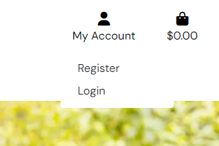
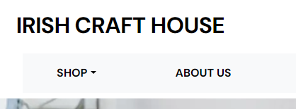
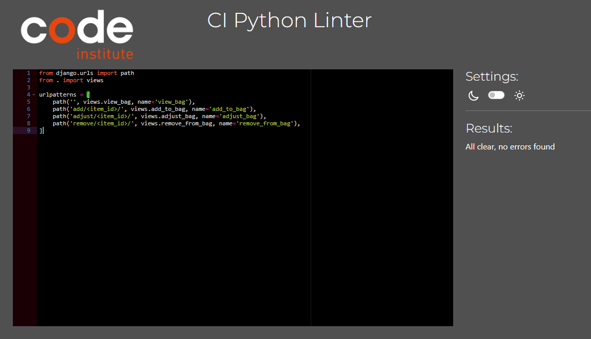
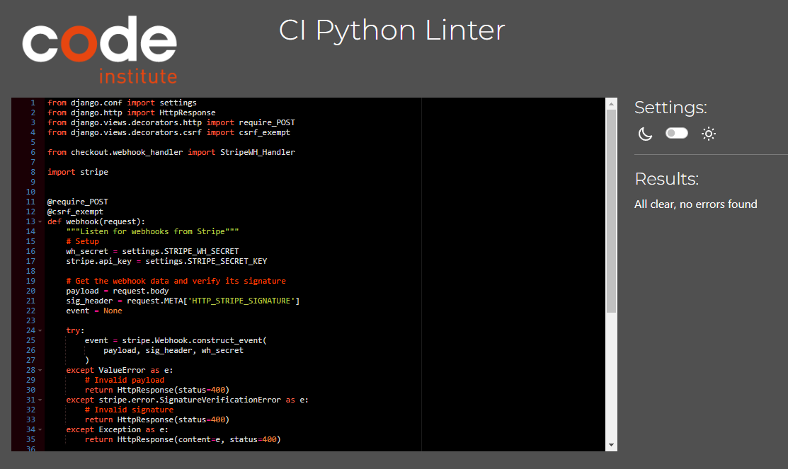
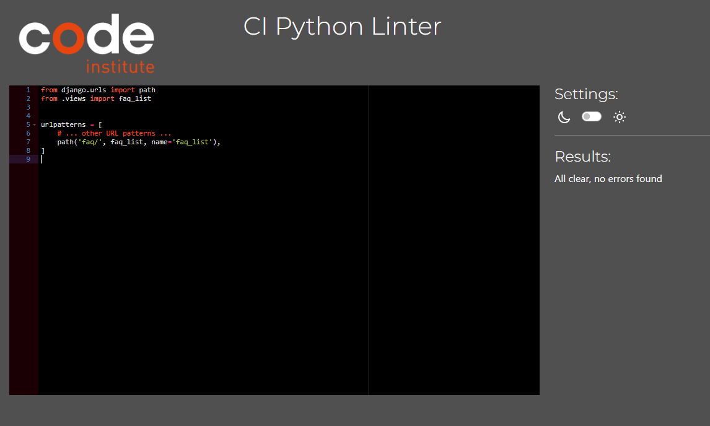

# Irish craft house


[](https://irish-craft-house-shop.herokuapp.com/)
[Link to Live Site](https://irishdesignhousepp5-45c81a68233a.herokuapp.com/)

## Table of Contents

- [Introduction](#introduction)
- [User Experience](#user-experience)
    * [User Goals](#user-goals)
    * [Site Owner Goals](#site-owner-goals)
    * [User Stories](#user-stories)
        + [Epic 1: Viewing and navigation](#epic-1-viewing-and-navigation)
        + [Epic 2: Registration and user accounts](#epic-2-registration-and-user-accounts)
        + [Epic 3: Sorting and searching](#epic-3-sorting-and-searching)
        + [Epic 4: Shopping cart management](#epic-4-shopping-cart-management)
        + [Epic 5: Account Management](#epic-5-account-management)
        + [Epic 6: admin panel functionality](#epic-6-admin-panel-functionality)
        + [Epic 7: email communication](#epic-7-email-communication)
- [Design](#design)
    * [Typography](#typography)
    * [Imagery](#imagery)
    * [Wireframes](#wireframes)
- [Features](#features)
    * [Header](#header)
    * [Index Page](#index-page)
    * [Product Pages](#product-pages)
    * [About us page](#about-us-page)
    * [Contact us Page](#contact-us-page)
    * [FAQ Page](#faq-page)
    * [Register/Login/Logout](#register--login--logout)
    * [Profile Page](#product-pages)
    * [Wishlist Page](#wishlist)
    * [Shopping Bag](#shopping-bag)
    * [Checkout Page](#checkout-page)
    * [Notifications](#notifications)
    * [Shop Management Features](#shop-management-features)
      + [Product management Page](#product-management-page)
    * [Future features](#future-features)

- [Search Engine Optimization (SEO) & Social Media Marketing](#search-engine-optimization-seo--social-media-marketing)
    * [Keyword Research](#keyword-research)
    * [Metadata](#metadata)
    * [Sitemap](#sitemap)
    * [Robots](#robots)
    * [Social Media Marketing](#social-media-marketing)

- [Testing](#testing)
    * [Validation of Code](#validation-of-code)
        + [HTML Validation](#html-validation)
        + [CSS Validation](#css-validation)
        + [Python Validation](#python-validation)
        + [Javascript validation](#javascript-validation)
    * [Manual Testing]
        + [Header](#header)
        + [Index Page](#index-page)
        + [Product Pages](#product-pages)
        + [About us page](#about-us-page)
        + [Contact us Page](#contact-us-page)
        + [FAQ Page](#faq-page)
        + [Register/Login/Logout](#register--login--logout)
        + [Profile Page](#product-pages)
        + [Wishlist Page](#wishlist)
        + [Shopping Bag](#shopping-bag)
        + [Checkout Page](#checkout-page)
        + [Notifications](#notifications)
        + [Shop Management Features](#shop-management-features)
          + [Product management Page]

- [](#)
    * [](#)


<!-- 
- [User Stories](#user-stories)
- [UX](#ux)
  * [Typography](#typography)
  * [Wireframes](#wireframes)
- [Accessibility](#accessibility)
- [Database Design](#database-design)
- [Features](#features)
- [Existing Features](#existing-features)
  * [Landing Page](#landing-page)
  * [Navbar](#navbar)
  * [Shopping Cart](#shopping-cart)
  * [Products List](#products-list)
  * [Product Detail Page](#product-detail-page)
  * [Register / Login](#register---login)
  * [Wishlist](#wishlist)
  * [Checkout](#checkout)
  * [Notification Emails](#notification-emails)
  * [Footer](#footer)
  * [Privacy Policy](#privacy-policy)
  * [Cookie Consent Banner](#cookie-consent-banner)
  * [Notifications](#notifications)
  * [Favicon](#favicon)
- [Staff Only Features](#staff-only-features)
  * [Shop Management Dashboard](#shop-management-dashboard)
  * [Products Detail](#products-detail)
  * [Printable Order Sheets](#printable-order-sheets)
  * [Dispatch Orders](#dispatch-orders)
  * [Custom Error Pages](#custom-error-pages)
  * [Features Left to Implement](#features-left-to-implement)
- [Technologies Used](#technologies-used)
- [External Python Packages Used](#external-python-packages-used)
- [Ecommerce Business Model](#ecommerce-business-model)
- [Search Engine Optimization (SEO) & Social Media Marketing](#search-engine-optimization--seo----social-media-marketing)
  * [Keywords](#keywords)
  * [Metadata](#metadata)
  * [Sitemap](#sitemap)
  * [Robots](#robots)
  * [Social Media Marketing](#social-media-marketing)
  * [Newsletter Marketing](#newsletter-marketing)
- [Testing](#testing)
  * [Browser Compatibility](#browser-compatibility)
  * [Responsiveness](#responsiveness)
  * [Performance Testing](#performance-testing)
  * [Accessibility Testing](#accessibility-testing)
  * [User Story Testing](#user-story-testing)
  * [Challenges Faced](#challenges-faced)
  * [Code Validation](#code-validation)
    + [HTML Validation](#html-validation)
    + [CSS Validation](#css-validation)
    + [Python Validation](#python-validation)
    + [JavaScript](#javascript)
- [Deployment](#deployment)
  * [ElephantSQL Database](#elephantsql-database)
  * [Amazon AWS](#amazon-aws)
    + [S3 Bucket](#s3-bucket)
    + [IAM](#iam)
    + [Final AWS Setup](#final-aws-setup)
  * [Heroku Deployment](#heroku-deployment)
  * [Local Deployment](#local-deployment)
    + [Cloning](#cloning)
    + [Forking](#forking)
- [Credits](#credits)
  * [Content](#content)
  * [Code](#code)
  * [Media](#media)
  * [Acknowledgements](#acknowledgements) -->

## Introduction

The project is an e-commerce website for a shop that offers designer craft items made in Ireland.

Both guests and registered users can explore products and add items to their shopping cart.

Registered users have the ability to place orders, create a wishlist, save their details for future visits, and view their past orders.

## User Experience

### User Goals

The main user goal would be to allow users to browse items easily on the site. The user should be able to view details of chosen items before deciding to buy. They should be able to add or remove items to their shopping basket and change the amount they would like. Users should be able to view and edit details about their account when logged in and change details.

### Site Owner Goals

The site owners main goal would be to be able to have full CRUD (Create, Read, Update, and Delete) functionality for products on the site. They should also be able to edit other content via the admin panel and to communicate with customers via email.

### User Stories

Seven Epics were decided upon with a total of 30 user stories. All user stories can be viewed here [Projects board](https://github.com/users/astro-mat/projects/4/views/1). Each user story was categorized into one of the following classes: Must have, Should have, Could have, or Won't have. Points were given to each user story based on the estimated time required for completion.

| Class | Points | Percentage of total points |
| -------------- | --------- | --------------- |
| Must have | 65 p | 54 % |
| Should have | 51 p | 43 % |
| Could have | 0 p | 0 % |
| Won't have | 4 p | 3 % |

The following user stories were completed in the first release of the Irish craft house website. To view the Won't have, they are listed here [Projects board](https://github.com/users/astro-mat/projects/4/views/1).

#### Epic 1: Viewing and navigation
**User Story - View a list of products**

As a shopper, I can view a list of products so that I can select some to purchase						

Acceptance Criteria 1 - When I navigate to the main product page, I see a grid or list of products.

**User Story - View a specific category of products**

As a shopper, I can view a specific category of products so that I can quickly find products I'm interested in without having to search though all products.						

Acceptance Criteria 1 - Users can find and select from a list of available product categories.

Acceptance Criteria 2 - Only products belonging to the selected category appear in the results.

Acceptance Criteria 3 - The display accurately reflects the category's contents.

**User Story - I can View individual product details**

As a Shopper, I can View individual product details so that I can identify the price, description, product rating, product image and available sizes.

Acceptance Criteria 1 - The product page shows all relevant details such as name, description, price

Acceptance Criteria 2 - High-quality images of the product are presented.

Acceptance Criteria 3 - "Add to Cart" and "Buy Now" buttons are prominently displayed.

**User Story - Quickly identify deals, clearance items and special offers**

As a Shopper, I can Quickly identify deals, clearance items and special offers so that I can take advantage of special savings on products I'd like to purchase.

Acceptance Criteria 1 - Prominent visual indicators for deals and discounts

Acceptance Criteria 2 - Easy-to-access deal listings

Acceptance Criteria 3 - Clear product information about promotions

**User Story - Easily view the total of my purchases at any time**

As a Shopper, Easily view the total of my purchases at any time so that I can avoid spending too much.

Acceptance Criteria 1 - The total is displayed prominently and updates in real-time as purchases are made.

Acceptance Criteria 2 - Shopper	find out information about the organisation	Decide if I like this company and what they stand for

Acceptance Criteria 3 - An "About Us" or similar section is prominently linked in the footer or header of every page.

**User Story - find answers to questions I may have**

As a Shopper, find answers to questions I may have so that I can be more informed before I decide to purchase.

Acceptance Criteria 1 - A dedicated FAQ page is easily accessible from the main navigation menu.

#### Epic 2: Registration and user accounts	

**User Story - Easily register for an account**

As a Site User, easily register for an account so that I can have a personal account and be able to view my profile.

Acceptance Criteria 1 - The registration form is concise and requires minimal information.

Acceptance Criteria 2 - The registration form submits promptly without unnecessary delays.

Acceptance Criteria 3 - After successful registration, users are shown a confirmation message.
							
**User Story - Easily login or logout**

As a Site User, easily login or logout so that I can access my personal account information.

Acceptance Criteria 1 - The login form is easily accessible and prominently displayed.

Acceptance Criteria 2 - Users receive immediate confirmation of successful login or logout.

Acceptance Criteria 3 - The interface clearly indicates whether the user is logged in or logged out.

**User Story - Easily recover my password in case I forget it**

As a Site User, easily recover my password in case I forget it so that I can recover access to my account.

Acceptance Criteria 1 - A clear "Forgot Password" link is visible on the login page.

Acceptance Criteria 2 - The system sends a password reset link to the registered email address.

Acceptance Criteria 3 - Upon successful password reset, users are notified and redirected to the login page.

**User Story - receive an Email confirmation after registering**

As a Site User, receive an Email confirmation after registering so that I can verify that my account registration was successful.

Acceptance Criteria 1 - An email is automatically sent to the registered email address immediately after registration.

Acceptance Criteria 2 - The subject line clearly indicates it's a confirmation email.

Acceptance Criteria 3 - The email is sent promptly after successful registration.

**User Story - have a personalised user profile**

As a Site User, have a personalised user profile so that I can view my personal order history and order confirmation and save my payment information..

Acceptance Criteria 1 - Users can quickly access their profile from a dedicated menu item.

Acceptance Criteria 2 - Users can edit and update their personal details through the profile page.

Acceptance Criteria 3 - Users can manage their account settings, notification preferences, and privacy options.

**User Story - Can access Emails sent via the website**

As an admin, I Can access Emails sent via the website so that I can see what emails have been sent via the website.

Acceptance Criteria 1 - Administrators have a dedicated section to view all emails sent through the website.

Acceptance Criteria 2 - Email logs include sender, recipient, subject, and timestamp.
							                                
**User Story - **

As a Shopper, contact the website admin so that I can ask any questions that I need to ask.

Acceptance Criteria 1 - A prominent "Contact" link or button is visible on the website.

Acceptance Criteria 2 - The contact form is simple and easy to fill out.

Acceptance Criteria 3 - Users receive immediate confirmation of form submission.		
                                    
                                    
**User Story - **

As a Shopper, I can add items to a wish list so that I can Decide weather or not to buy it later.

Acceptance Criteria 1 - A dedicated "Add to Wish List" button is visible on product pages.

Acceptance Criteria 2 - Items are immediately added to the user's wish list when clicked.

Acceptance Criteria 3 - Users can easily access and view their wish list from a dedicated page.	
                                    
#### Epic 3: Sorting and searching	    

**User Story - sort the list of available products**

As a Shopper, sort the list of available products so that I can easily identify the best rated, best priced and categorically sorted products.

Acceptance Criteria 1 - Users can sort products by at least three criteria: best-rated and category.

Acceptance Criteria 2 - Sorting options are clearly visible and easily selectable.

Acceptance Criteria 3 - The sorted list updates immediately when a new sorting option is chosen.
                                    
**User Story - sort a specific category of product**
                                    
As a Shopper, I can sort a specific category of product so that I can find the best-priced or best-rated product in a specific category or sort the products in that category by name.

Acceptance Criteria 1 - Sorting directions (ascending/descending) are provided for each option.

Acceptance Criteria 2 - Users can easily see which sorting criterion is being applied at any given time.

                             
**User Story - sort multiple categories of products simultaneously**
                                    
As a Shopper, I can sort multiple categories of products simultaneously so that I can find the best-priced or best-rated products across broad categories such as "homewares" or "Jewellery".

Acceptance Criteria 1 - Users can select multiple categories to sort together.

Acceptance Criteria 2 - The sorting algorithm applies the chosen criteria uniformly across all selected categories.

Acceptance Criteria 3 - Users can easily see the combined result of their selections.					
                                    
**User Story - I can search by a product name or description**
                                    
As a Shopper, I can search by a product name or description so that I can find a specific product I'd like to purchase.

Acceptance Criteria 1 - Users can search for products using both exact matches and partial matches of names and descriptions.

Acceptance Criteria 2 - A prominent search bar is easily accessible on product pages and the main site.


**User Story - **
                                    
As a Shopper, I can easily see what I've searched for and the number of results so that I can quickly see whether the product I want is available.

Acceptance Criteria 1 - The number of results found is prominently displayed near the search box.

Acceptance Criteria 2 - A list of search results is shown on the search results page.

#### Epic 4: Shopping cart management
                                    
**User Story - Add items to shopping cart**
                                    
As a Shopper, I can Add items to shopping cart so that I can Purchase the items at the same time.

Acceptance Criteria 1 - Clicking the "Add to Cart" button adds the item to the cart.

Acceptance Criteria 2 - The cart icon displays the number of items in the cart.

Acceptance Criteria 3 - The cart total updates automatically after adding items
    							
                                    
**User Story - Remove items from shopping cart**
                                    
As a Shopper, I can Remove items from shopping cart so that I can reduce the selection of items that I want to buy.

Acceptance Criteria 1 - Clicking the "Remove" button removes the item from the cart.

Acceptance Criteria 2 - The cart icon updates to reflect the new item count.

Acceptance Criteria 3 - The cart total adjusts accordingly after removing items.
                                    
        							
**User Story - Change quantity in shopping cart**
                                    
As a shopper, I can Change quantity in shopping cart so that I can change how many of individual items I wish to purchase.

Acceptance Criteria 1 - Entering a value in the quantity field updates the cart total.

Acceptance Criteria 2 - Clicking "Update" applies the quantity change.

Acceptance Criteria 3 - The cart displays the updated quantity and price.

#### Epic 5: Account management	                            
                                    
**User Story - View account details**
                                    
As a Logged in user, I can View account details so that I can check if they are correct.

Acceptance Criteria 1 - My profile information is displayed on the account page.

Acceptance Criteria 2 - All order history is visible.

Acceptance Criteria 3 - My saved addresses and payment methods are accessible.


**User Story - Edit account details**
                                    
As a Logged in user, I can Edit account details so that I can make changes if they need to be made.

Acceptance Criteria 1 - I can update my name, email, and password

Acceptance Criteria 2 - Changes are reflected immediately upon saving

Acceptance Criteria 3 - Error messages are displayed for invalid inputs
    								
#### Epic 6: admin panel functionality
                     
**User Story - Create products**
                                    
As an admin, I can create products so that I can sell new products on the site.

Acceptance Criteria 1 - I can add product name, description, price, and images

Acceptance Criteria 2 - Categories and tags can be assigned to products

Acceptance Criteria 3 - Product creation is confirmed with a success message
    								
                                    
**User Story - Update product details**
                                    
As an admin, I can update product details so that I can make changes to products when they change.

Acceptance Criteria 1 - I can modify product name, description, price, and images

Acceptance Criteria 2 - Category and tag assignments can be changed

Acceptance Criteria 3 - Updated product information is reflected immediately
        						
    					
**User Story - Remove products from the site**
                                    
As an admin, I can remove products from the site so that I can remove them when they become non-stock items.

Acceptance Criteria 1 - Deleting a product removes it from the catalog

Acceptance Criteria 2 - Associated orders are marked as canceled

Acceptance Criteria 3 - A confirmation message is displayed after deletion

#### Epic 7: email communication
								
**User Story - Send order confirmation emails**
                                    
As an admin , I can Send order confirmation emails so that I can confirm to the customer that an order has been received.

Acceptance Criteria 1 - Emails are sent automatically after successful checkout

Acceptance Criteria 2 - Order details are included in the email

Acceptance Criteria 3 - Recipients can easily access their order status
                                    
        						
**User Story - send automated password reset emails**
                                    
As an admin, I can send automated password reset emails so that I can allow users to use the logged in functions automatically in the event of password loss.

Acceptance Criteria 1 - Emails are sent automatically when a password reset request is made

Acceptance Criteria 2 - Reset link is valid for a limited time

Acceptance Criteria 3 - Password reset is confirmed via email after successful change

## Design

The website was designed with a clean, simple look to reflect the quality design aspect of the brand. Simple black and white colour scheme was chosen which supported this choice and provided high contrast.

### Typography

The typography was chosen to fit in with the design style established by the colour choices earlier while still being easy to read. Capitalisation was employed for titles to re-enforce this design choice.

### Imagery

High quality imagery was important as it signals to prospective customers what they can expect. Wherever possible, lifestyle images are used to re-enforce the brand

### Wireframes
Wireframes were made using [Balsamiq](https://balsamiq.com/) of the home page and products page. 

#### Home page


#### Products page


## Features

### Header

#### Navigation bar


- The navigation bar makes it easy for the user to navigate the site. 
- The navbar is fixed to the top of all pages to allow easy navigation
- The Navbar contains dropdown menus to browse the shop, the website logo and a search bar
- The shop dropdown shows links to all the product categories


- There is a "My Account" dropdown which looks different depending on the user

A non logged in user sees an option to either register or login



A logged in shopper sees a link to view their profile, to view wish-lists and to logout


A logged in admin level user sees the same but with the addition of a product management link


### Index page


- The index page is dominated by the hero image is a simple lifestyle shot which conforms to the overall theme of the site. Over the top of this is a bold statement for the webshop and contains core keywords for SEO purposes
- This section provides the user with a clear visual opening to the site and what to expect
- Below the statement is a call to action button inviting the user to "SHop Now" and enter the main shop

### Product Pages

#### All products page

- The all products page is arrived at after the main call to action button on the hero image.


- There is a drop down filter menu to allow the user to filter the displayed products by various different categories.


- A logged in admin user sees the same information, except for the options to edit or delete each product.


#### Product detail page

- When product is clicked, the user is taken to the product detail page
- A more detailed description of the selected product is displayed
- Buttons to add the item to the basket or to the wishlist are displayed together with a quantity box to select how many of the items the user would like to purchase.


- A logged in Admin user again sees the option to edit or delete the product


### About Us page

- The about us page gives a short description of the histary and background of company and website
- A "Back To shop" allows users to easily navigate to the main shop page


### Contact Us Page

- The contact us page allows the user to contact the admin
- The user enters name, email and a message. Form validation is present. A button allows the message to be sent
- Once sent, a message is sent to the admin email address and a confirmation is sent to the user. THe message is also available in the website admin.
- The page also provides all the proposed social links for the website


### FAQ Page

- The FAQ page allows the admin to convey information taht is often asked to the user.
- The questions and answers can be edited from the admin panel by the admin user.
- There is a "Keep shopping" button to take the user back to the shopping page


### Register/Login/Logout

- Users are required to sign in in order to make a purchase on the site
- After signing up, users need to verify their account by clicking the link in the welcome email.
- New users can choose either to login if they already have an account, or register if they do not

#### Register page

- The new user is invited to enter details in order to create an account
- Form has full validation error checking. 
- A notice states that if the user already have an account, Then please sign in. A link is provided for this (See below)
- Once a user registers, they are sent a confirmation email with a link that needs to be clicked to allow login


#### Verify Your E-mail Address Page

- After registering for an account, the user reaches this page instructing them to check emails for a confirmation
- The Email contains a link to Confirm E-mail Address

#### Confirm E-mail Address page

- The user can select a button that confirms the email.
- They are then taken to the Login page where they can now login

#### Login page

- If the user has an existing account, they can enter their details here to login
- There is an option to "Remember me" so that the user can chose to not have to enter their details in future sessions
- A link is provided for if the user has forgotten their password (See below)
- Once successfully signed in, they are taken to the index page

#### Log Out Page

- A simple page that the user can either choose to logout with (via button)
- If the user changes their mind, they can select "Cancel"
- Both options take the user to the index page

#### Reset Password Page

- The user is prompted to enter email address
- Once Email is entered and "Reset my password" button is pressed, an email is sent to the email address with further instructions
- The user can also choose to go back to login page if they realise that they have remembered their password.

#### Password reset success page

- Once the email has been entered on Reset Password Page and submitted, the user is taken to this page.
- The user is asked to check their email
- The email contains a link
- The link leads to the change password page

#### Change Password Page

- The user is invited to change there password
- Warnings are given if the new password does not pass the validation

#### Change password Success Page

- This page simply informs the user that there password has been changed
- They can now login with their new password

### Profile Page

- This page is accessed from the "My Account" Dropdown in the main header 
- The user can update their address and phone number
- The page also displays their order history listing any orders they have made, order number, date, items and total cost

### Wishlist Page

- If items are added to the users wishlist, they can be viewed here.
- A simple summary of all the items in the users wishlist is displayed including item description, item image.
- Each item has buttons that can add the item to the shopping bag or remove from the wishlist

### Shopping Bag

- This page displays a list of all the items that the user has selected to be eventually purchased.
- Each product is listed in a table with its image, description, size (If applicable), SKU, price, quantity and sub total
- The quantity can be increased or decreased
- the item can be removed if desired
- At the bottom is a total, a calculated shipping charge and a grand total
- The user is then invited to either keep shopping (Back to products page) or continue to checkout

### Checkout page

- Here, the user can fill in their name and shipping address
- an option is included to Save this delivery information to the users profile
- An order summary is displayed detailing an image, description, size (If applicable), SKU, price, quantity and sub total
- At the bottom is a total, a calculated shipping charge and a grand total
- Payment details are to be entered before purchase can be made
- Buttons are included which invite the user to either go back and adjust the bag contents or complete the order

### Notifications

- Notifications are given to the user for all significant events on the website. These include;
        + asdfasd
        + asdasdasd
        + When editing/adding/deleting a product

### Shop Management Features

- There are several features of the website that are only accessible to logged in users with admin rights
- Staff users can only be created within the Django Admin panel

#### Product management Page

- Here a user can add a product by entering in the details and choosing an image
- Only valid entries are allowed otherwise a warning notification is issued
- The page is accessed via the "My Account" Drop down menu (Logged in staff users only)
- The page is also accessed when either "Edit" or "Delete" is clicked on any product. When this happens, the page is populated with the details of the relevant product
- For more detailed editing features, the user can log into the Django admin interface

### Future Features

Several features can be added in the future.

- Add more content to home page.
- Add footer to home page
- Add more functionality to the wishlist page. Ability to change quantity, better layout to more closely match the shopping bag design

## Search Engine Optimization (SEO) & Social Media Marketing

### Keyword Research

To enhance Google search index ratings, various tools were utilised, including Moz and QuestionDB, to identify relevant keywords for incorporation into meta tags, alt-text descriptions, and content elements of the project.

The first step was to brainstorm general topics and keywords; 
**General Handmade Craft Items**
- Handmade crafts
- Unique handmade items
- Artisan goods
- Handcrafted products
- Irish handmade crafts
- Celtic crafts
- Traditional Irish crafts
**Specific Categories**
- Handmade jewellery
- Knitted items
- Woodcarvings
- Pottery
- Textiles
- Glasswork
- Metalwork
- Leathercraft
- Ceramics
- Embroidery
**Seasonal/Holiday-Themed Crafts**
- Christmas ornaments
- Easter decorations
- Halloween accessories
- St. Patrick's Day gifts
- Valentine's Day crafts
- Summer garden decor
- Autumn-themed crafts
**Irish-Themed Crafts**
- Shamrock designs
- Celtic knot patterns
- Leprechaun figurines
- Claddagh rings
- Irish heritage crafts
- Celtic cross jewelry
- Triskelion symbols
**Long-Tail Keywords**
- Handmade Irish wool scarves
- Customizable Celtic-inspired jewelry
- Hand-painted Irish pottery
- Hand-knitted Aran sweaters
- Handmade Irish crystal jewelry
- Hand-carved wooden Irish flutes
- Handmade Irish linen table runners

These were then assessed for relevance and authoritativeness.

**Relevance Assessment**
- General keywords: Highly relevant
    Terms like "handmade crafts," "artisan goods," and "unique handmade items" directly relate to the website's offerings.
- Specific categories: Moderately relevant
    While specific categories like "knitted items" or "woodcarings" are relevant, they might be too broad for SEO purposes.
- Seasonal/holiday-themed crafts: Relevant but limited
    These keywords are seasonal and may have limited long-term impact.
- Irish-themed crafts: Very relevant
    Keywords like "Celtic crafts" and "Irish heritage crafts" are highly relevant to the target audience.
- Long-tail keywords: Most relevant
    These specific product descriptions are highly targeted and likely to attract relevant traffic.
**Authoritativeness Assessment**
- General terms: Good foundation
    Using authoritative terms like "handmade crafts" establishes credibility.
- Specific categories: Limited authority
    While specific categories exist, they don't necessarily convey expertise.
- Irish-specific terms: Strong authority
    Terms like "Irish heritage crafts" suggest deep knowledge of Irish craft traditions.
- Long-tail keywords: Strong authority
    These specific product descriptions demonstrate expertise in particular craft types.

Based on this, the top keywords could be identified:

- Handmade Irish crafts
- Unique Celtic-inspired jewellery
- Traditional Irish pottery
- Hand-knitted Aran sweaters
- Customizable Irish crystal jewellery
- Hand-carved wooden Irish flutes
- Handmade Irish linen table runners
- Shamrock designs
- Claddagh rings
- Irish heritage crafts


**General steps to improve SEO Results**
based on this research base.html and index.html were changed in order to better represent the identified keywords. The main logo was changed from a H1 tag to a span so that our H1 could be used in the hero image with two of our identified keywords.




### Metadata
I included Metadata to help with SEO results. Keywords, description and title were all used as opportunities to improve SEO.

### Sitemap

I've used [XML-Sitemaps](https://www.xml-sitemaps.com) to generate a sitemap.xml file.
This was generated using my deployed site URL: https://irishdesignhousepp5-45c81a68233a.herokuapp.com/

After it finished crawling the entire site, it created a
[sitemap.xml](sitemap.xml) which I've downloaded and included in the root of the repository.

### Robots

I've created the [robots.txt](robots.txt) file at the root-level.
Inside, I've included the settings:

```
User-agent: *
Disallow: /profile/
Disallow: /bag/
Sitemap: https://irishdesignhousepp5-45c81a68233a.herokuapp.com/sitemap.xml
```

Further links for future implementation:
- [Google search console](https://search.google.com/search-console)
- [Creating and submitting a sitemap](https://developers.google.com/search/docs/advanced/sitemaps/build-sitemap)
- [Managing your sitemaps and using sitemaps reports](https://support.google.com/webmasters/answer/7451001)
- [Testing the robots.txt file](https://support.google.com/webmasters/answer/6062598)

### Social Media Marketing

I included links in on the contact page which could be used for potential Facebook, Twitter, Instagram and TikTok presences for the business.

I've created a mockup Facebook business account using the
[Balsamiq template](https://code-institute-org.github.io/5P-Assessments-Handbook/files/Facebook_Mockups.zip)
provided by Code Institute.


For this business I envision a lot of the social media marketing being very visual, using the current most popular formats like Instagram Reels and TikTok. As these are primarily video based I did not mock any for the purposes of this coding project.

## Testing

### Validation of Code

#### HTML Validation


All the pages were tested at the [W3C Markup Validation Service](https://validator.w3.org/). The index page validation is above, all the other validations are linked below.

- [Add product page](docs/images/add-product-valid.PNG)
- [Edit Product page](docs/images/edit-product-valid.PNG)
- [Product Detail page](docs/images/product-detail-valid.PNG)
- [Product page](docs/images/product-page-valid.PNG)
- [FAQ page](docs/images/faq-page-valid.PNG)
- [Contact us page](docs/images/contact-us-valid.PNG)
- [Contact Success](docs/images/contact-success-valid.PNG)
- [Profile Page](docs/images/profile-page-valid.PNG)
- [Sign up Page](docs/images/sign-up-html-valid.PNG)
- [Login Page](docs/images/register-html-valid.PNG)
- [Log Out Page](docs/images/log-out-html-valid.PNG)
- [Password Reset Page](docs/images/password-reset-html-valid.PNG)
- [Wishlist Page](docs/images/wishlist-valid.PNG)


#### CSS Validation


The CSS code was tested at [W3C CSS Validation Service](https://jigsaw.w3.org/css-validator/). The process completed without errors.

#### Python Validation

All Python files have been validated using the [CI Python Linter](https://pep8ci.herokuapp.com/) to ensure they meet PEP8 standards. The validation process completed without any errors.

##### about_us

**about us - views.py**


**about us - models.py**


**about us - admin.py**


**about us - urls.py**


**about us - apps.py**


##### bag

**bag - views.py**


**bag - urls.py**



**bag - apps.py**


##### checkout

**checkout - views.py**


**checkout - models.py**


**checkout - admin.py**


**checkout - forms.py**


**checkout - urls.py**


**checkout - apps.py**


**checkout - webhook_handler.py**


**checkout - webhooks.py**



##### contact

**contact - views.py**


**contact - models.py**


**contact - admin.py**


**contact - forms.py**


**contact - urls.py**


**contact - apps.py**


##### faq

**faq - views.py**


**faq - models.py**


**faq - admin.py**


**faq - urls.py**



**faq - apps.py**


##### home

**home - views.py**


**home - urls.py**


**home - apps.py**


##### irish_craft_house

**irish_craft_house - views.py**


**irish_craft_house - urls.py**


**irish_craft_house - settings.py**


**irish_craft_house - wsgi.py**


##### products

**products - views.py**


**products - models.py**


**products - admin.py**


**products - forms.py**


**products - urls.py**


**products - apps.py**


##### profiles

**profiles - views.py**


**profiles - models.py**


**profiles - forms.py**


**profiles - urls.py**


**profiles - apps.py**


##### wishlist

**wishlist - views.py**


**wishlist - models.py**


**wishlist - forms.py**


**wishlist - urls.py**


**wishlist - apps.py**


### Javascript validation

### Browser compatibility

### Responsiveness

### Performance Testing

### Accessibility Testing

### Lighthouse

Tests in Lighthouse were performed for both desktop and mobile.

#### Desktop


The test for desktop resulted in scores all over 90.

#### Mobile


The test for mobile resulted in scores all over 90 except for the best practices which scored 74. I am confident that this could be easily improved particularly by paying attention to the use of cookies on the site


### Manual Testing

Every page at the website has been manually tested. It is done in Google Chrome DevTools and on different devices. The devices used were one mobile phone, one laptop and one external screen:

- Samsung Galaxy A52s (1080 x 2400)
- HP 250 G4 Notebook PC (1366 x 768)
- HP 2309v LCD Screen (1920 x 1080)


#### Header
| Feature being tested | Expected Outcome | Testing Performed | Actual Outcome | Result (Pass or fail) |
| -------------------- | ---------------- | ----------------- | -------------- | --------------------- |
| Home/logo link | When clicked, directs the user to the home page | Click at "Home" | Got directed to the home page | Pass |

##### Nav Menu
| Feature being tested | Expected Outcome | Testing Performed | Actual Outcome | Result (Pass or fail) |
| -------------------- | ---------------- | ----------------- | -------------- | --------------------- |
| Shop drop-down | When clicked, dropdown appears with further links to product categories | Click at "SHOP" | Dropdown appeared | Pass |
| Products link | When clicked, directs the user to a filtered list of all products | Click at "products" | Got directed to a filtered list of all products | Pass |
| By Price link | When clicked, directs the user to a filtered list of By Price | Click at "By Price" | Got directed to a filtered list of By Price | Pass |
| By Rating link | When clicked, directs the user to a filtered list of By Rating | Click at "By Rating" | Got directed to a filtered list of By Rating | Pass |
| By Category link | When clicked, directs the user to a filtered list of By Category | Click at "By Category" | Got directed to a filtered list of By Category | Pass |
| All Products link | When clicked, directs the user to a filtered list of all products | Click at "All products" | Got directed to a filtered list of all products | Pass |
| Jewellery link | When clicked, directs the user to a filtered list of Jewellery | Click at "Jewellery" | Got directed to a filtered list of All Jewellery | Pass |
| Pendants & Earings link | When clicked, directs the user to a filtered list of Pendants & Earings | Click at "Pendants & Earings" | Got directed to a filtered list of Pendants & Earings | Pass |
| Cufflinks, Tie clips & Lapel Pins link | When clicked, directs the user to a filtered list of Cufflinks, Tie clips & Lapel Pinss | Click at "Cufflinks, Tie clips & Lapel Pins" | Got directed to a filtered list of Cufflinks, Tie clips & Lapel Pins | Pass |
| All Jewellery link | When clicked, directs the user to a filtered list of Jewellery | Click at "All Jewellery" | Got directed to a filtered list of All Jewellery | Pass |
| Baby & Kids link | When clicked, directs the user to a filtered list of Baby & Kids | Click at "Baby & Kids" | Got directed to a filtered list of Baby & Kids | Pass |
| Skincare link | When clicked, directs the user to a filtered list of Skincare | Click at "Skincare" | Got directed to a filtered list of Skincare | Pass |
| Face, Body, Bath & Balms link | When clicked, directs the user to a filtered list of Face, Body, Bath & Balms | Click at "Face, Body, Bath & Balms" | Got directed to a filtered list of Face, Body, Bath & Balms | Pass |
| Soap & Shaving Soaps link | When clicked, directs the user to a filtered list of Soap & Shaving Soaps | Click at "Soap & Shaving Soaps" | Got directed to a filtered list of Soap & Shaving Soaps | Pass |
| All Skincare link | When clicked, directs the user to a filtered list of Skincare | Click at "All Skincare" | Got directed to a filtered list of Skincare | Pass |
| Unique Pieces link | When clicked, directs the user to a filtered list of Unique Pieces | Click at "Unique Pieces" | Got directed to a filtered list Unique Pieces | Pass |
| Prints & Books link | When clicked, directs the user to a filtered list of Prints & Books | Click at "Prints & Books" | Got directed to a filtered list Prints & Books | Pass |
| Bags link | When clicked, directs the user to a filtered list of Bags | Click at "Bags" | Got directed to a filtered list Bags | Pass |

##### Search Box
| Feature being tested | Expected Outcome | Testing Performed | Actual Outcome | Result (Pass or fail) |
| -------------------- | ---------------- | ----------------- | -------------- | --------------------- |
| Search Box | When clicked, redirects to item in text box | Search for known item | Got directed to desired item | Pass | 
| Search Box | When clicked, redirects to item in text box | Search for keyword item | Got directed to list of items containing keyword | Pass | 

##### My Account Dropdown
| Feature being tested | Expected Outcome | Testing Performed | Actual Outcome | Result (Pass or fail) |
| -------------------- | ---------------- | ----------------- | -------------- | --------------------- |
| My account dropdown | The menu drops down | Click on the Button | The menu dropped down | Pass |
| Register link | The link takes me to the Register page | Click on link | Link takes user to the Register page | Pass |
| Login Link |  The link takes me to the Login page | Click on link | Link takes user to the Login page | Pass |

##### My Account Dropdown (Logged in shoppers)
| Feature being tested | Expected Outcome | Testing Performed | Actual Outcome | Result (Pass or fail) |
| -------------------- | ---------------- | ----------------- | -------------- | --------------------- |
| View Wishlist Link | The link takes me to the Wishlist page | Click on link | Link takes user to the Wish page | Pass |
| The Log-out Link | The link takes me to the Logout page page | Click on link | Link takes user to the Wish page | Pass |
| Log-Out | Loose access to logged in content | Click on log-out link | Lost access to logged in content | Pass |
| Log-Out | Redirect to Log-Out Page | Click on log-out link | Redirected to Log-Out Page | Pass | 
| Log-Out | Toast notification that you have logged out | Click on log-out link | Toast notification is visible | Pass |

##### My Account Dropdown (Logged in Admin)
| Feature being tested | Expected Outcome | Testing Performed | Actual Outcome | Result (Pass or fail) |
| -------------------- | ---------------- | ----------------- | -------------- | --------------------- |
| Product Management Link | The link takes me to the Wishlist page | Click on link | Link takes user to the Wish page | Pass |

##### Shopping Bag (Logged in Admin)
| Feature being tested | Expected Outcome | Testing Performed | Actual Outcome | Result (Pass or fail) |
| -------------------- | ---------------- | ----------------- | -------------- | --------------------- |
| Shopping Bag Link | The link takes me to the Shopping Bag page | Click on link | Link takes user to the Shopping Bag | Pass |

#### Index Page
| Feature being tested | Expected Outcome | Testing Performed | Actual Outcome | Result (Pass or fail) |
| -------------------- | ---------------- | ----------------- | -------------- | --------------------- |
| Responsive design | The page changes so the content fit at the smallest to the largest screens without scrolling sideways | In DevTools, select the smallest device and make it larger step by step | The index page was responsive and changed depending on screen size | Pass |
| "Shop Now" button | Directs the user to the "Shop Now" page | Click at the "Shop Now" button | Got directed to the Shop Now page | Pass |
| Text readability | Enough margins and padding to make text readable | Read all text blocks at all different Bootstrap breakpoints | The text is readable at all breakpoints | Pass |

#### Products Page (Guest shopper and Logged in shopper)
| Feature being tested | Expected Outcome | Testing Performed | Actual Outcome | Result (Pass or fail) |
| -------------------- | ---------------- | ----------------- | -------------- | --------------------- |
| Responsive design | The page changes so the content fit at the smallest to the largest screens without scrolling sideways | In DevTools, select the smallest device and make it larger step by step | The page was responsive and changed depending on screen size | Pass |
| Text readability | Enough margins and padding to make text readable | Read all text blocks at all different Bootstrap breakpoints | The text is readable at all breakpoints | Pass |
| Redirected after clicking on a product | When user clicks on product image, the user gets redirected to the product detail Page  | CLick on product image | The user got redirected to Product detail page | Pass |
| Sort by... Function Price (Low to high) | Select the option and page filters product list accordingly | Click on the option | Pages features the correct filtered list | Pass |
| Sort by... Function Price (high to Low) | Select the option and page filters product list accordingly | Click on the option | Pages features the correct filtered list | Pass |
| Sort by... Function Price (Low to High) | Select the option and page filters product list accordingly | Click on the option | Pages features the correct filtered list | Pass |
| Sort by... Rating (high to Low) | Select the option and page filters product list accordingly | Click on the option | Pages features the correct filtered list | Pass |
| Sort by... Rating (Low to High) | Select the option and page filters product list accordingly | Click on the option | Pages features the correct filtered list | Pass |
| Sort by... Name (A-Z) | Select the option and page filters product list accordingly | Click on the option | Pages features the correct filtered list | Pass |
| Sort by... Name (Z-A) | Select the option and page filters product list accordingly | Click on the option | Pages features the correct filtered list | Pass |
| Sort by... Category (A-Z) | Select the option and page filters product list accordingly | Click on the option | Pages features the correct filtered list | Pass |
| Sort by... Category (Z-A) | Select the option and page filters product list accordingly | Click on the option | Pages features the correct filtered list | Pass |

#### Products Page (Logged In Admin)
| Feature being tested | Expected Outcome | Testing Performed | Actual Outcome | Result (Pass or fail) |
| -------------------- | ---------------- | ----------------- | -------------- | --------------------- |
Edit Product Redirect| When the "Edit" button is pressed, User is redirected to Product Management Page | Visit Product Page, Select a item to edit, Click "Edit" | The user got redirected to Product Management Page for that item | Pass |
Delete Product |  When the "Delete" button is pressed, User is redirected to Product Management Page | Visit Product Page, Select a booking to delete, Click "Delete" | The user got redirected to Product Management Page for that item | Pass |

#### Product Detail Page
| Feature being tested | Expected Outcome | Testing Performed | Actual Outcome | Result (Pass or fail) |
| -------------------- | ---------------- | ----------------- | -------------- | --------------------- |
| Quantity Button | Changes the quantity desired before adding to the bag | Click on "+" "&" - buttons | Quantity changed in increments up and down | Pass |
| "Keep Shopping" button | Re-Directs user back to the "All Products" Page | Click on the "Keep Shopping" Button | Re-directed to the "All Products" Page | Pass |
| "Add to Bag" button | Adds item to the shopping bag | Click on the "Add to Bag" Button | Item is added to the shopping bag | Pass |
| "Add to Bag" Notification | Notification pops up indicating item is added to the shopping bag | Click on the "Add to Bag" Button | Notification pops up indicating item is added to the shopping bag | Pass |
| "Add to Bag" Notification | Notification shows updated contents of shopping bag and total cost | Click on the "Add to Bag" Button | Notification pops up showing updated contents of shopping bag and total cost | Pass |


#### Product Detail Page (Logged In Shopper)
| Feature being tested | Expected Outcome | Testing Performed | Actual Outcome | Result (Pass or fail) |
| -------------------- | ---------------- | ----------------- | -------------- | --------------------- |
| "Wishlist" button | Adds item to the wishlist | Click on the "Wishlist" Button | Item is added to the wishlist | Pass |
| "Wishlist" Notification | Notification pops up indicating item is added to the wishlist | Click on the "Wishlist" Button | Notification pops up indicating item is added to the wishlist | Pass |

#### Product Detail Page (Logged In Admin)
| Feature being tested | Expected Outcome | Testing Performed | Actual Outcome | Result (Pass or fail) |
| -------------------- | ---------------- | ----------------- | -------------- | --------------------- |
Edit Product Redirect| When the "Edit" button is pressed, User is redirected to Product Management Page | Visit Product Page, Select a item to edit, Click "Edit" | The user got redirected to Product Management Page for that item | Pass |
Delete Product |  When the "Delete" button is pressed, User is redirected to Product Management Page | Visit Product Page, Select a booking to delete, Click "Delete" | The user got redirected to Product Management Page for that item | Pass |

#### About us Page
| Back to shop Button | Re-Directs user back to the "All Products" Page | Click on the "Keep Shopping" Button | Re-directed to the "All Products" Page | Pass |
| Responsive design | The page changes so the content fit at the smallest to the largest screens without scrolling sideways | In DevTools, select the smallest device and make it larger step by step | The page was responsive and changed depending on screen size | Pass |
| Text readability | Enough margins and padding to make text readable | Read all text blocks at all different Bootstrap breakpoints | The text is readable at all breakpoints | Pass |


<!-- 
#### Contact us Page
#### FAQ Page
#### Register/Login/Logout Pages
#### Profile Page
#### Wishlist Page
#### Shopping Bag
#### Checkout Page
#### Notifications
#### Shop Management Features
##### Product Management Page


#### Log In Page

| Feature being tested | Expected Outcome | Testing Performed | Actual Outcome | Result (Pass or fail) |
| -------------------- | ---------------- | ----------------- | -------------- | --------------------- |
| Responsive design | The page changes so the content fit at the smallest to the largest screens without scrolling sideways | In DevTools, select the smallest device and make it larger step by step | The page was responsive and changed depending on screen size | Pass |
| Text readability | Enough margins and padding to make text readable | Read all text blocks at all different Bootstrap breakpoints | The text is readable at all breakpoints | Pass |
| All fields required | An error message appears when the user tries to sign in but leaves one field empty | Leave one field empty one by one and try to Sign In | An error message appeared when a field was left empty | Pass |
| Remember me button | when selected when logging in, user details are remembered at next login | select when logging in, log out and return | User details were remembered on returning to the page | Pass |
| Sign In button | When the "Sign In" button is pressed, the user gets signed in | Click at "Sign In" button | The user gets signed in | Pass |
| Redirected | When the "Sign In" button is pressed, the user gets redirected to the booking detail page | Visit Register page, click Sign in, press "Sign In" button | The user got redirected to Booking Detail page | Pass |
| Sign Up button | When the "Sign Up" button is pressed, the user redirected to Register page | Click at "Sign Up" button | The user gets redirected to Register/Login page | Pass |
| Forgotten Password Link | When link is clicked, user is redirected to password reset page | Visit Log In page, click on "Forgot password" Link | When link is clicked, user is redirected to password reset page | Pass

### Register page

| Feature being tested | Expected Outcome | Testing Performed | Actual Outcome | Result (Pass or fail) |
| -------------------- | ---------------- | ----------------- | -------------- | --------------------- |
| Responsive design | The page changes so the content fit at the smallest to the largest screens without scrolling sideways | In DevTools, select the smallest device and make it larger step by step | The page was responsive and changed depending on screen size | Pass |
| Text readability | Enough margins and padding to make text readable | Read all text blocks at all different Bootstrap breakpoints | The text is readable at all breakpoints | Pass |
| All fields required | An error message appears when the user tries to sign up but leaves one field empty | Leave one field empty one by one and try to Sign Up | An error message appeared when a field was left empty | Pass |
| Redirected | When the "Sign Up" button is pressed, the user gets redirected to the Booking Detail Page  | Visit Register page, fill out all required fields, press "Sign Up" button | The user got redirected to Booking Detail page | Pass |

#### Booking Detail page

| Feature being tested | Expected Outcome | Testing Performed | Actual Outcome | Result (Pass or fail) |
| -------------------- | ---------------- | ----------------- | -------------- | --------------------- |
| Responsive design | The page changes so the content fit at the smallest to the largest screens without scrolling sideways | In DevTools, select the smallest device and make it larger step by step | The page was responsive and changed depending on screen size | Pass |
| Text readability | Enough margins and padding to make text readable | Read all text blocks at all different Bootstrap breakpoints | The text is readable at all breakpoints | Pass |
| All fields required | An error message appears when the user tries to make a booking but leaves one field empty | Leave one field empty one by one and try to Make a booking | An error message appeared when a field was left empty | Pass |
| Redirected after "Make A Booking" | When the "Make a booking" button is pressed, the user gets redirected to the Booking Success Page  | Visit Booking Detail page, fill out all required fields, press "Make a booking" button | The user got redirected to Booking Success page | Pass |
Edit Booking Redirect| When the "Edit" button is pressed, User is redirected to Edit Booking page | Visit Booking Detail Page, Select a booking to edit, Click "Edit" | The user got redirected to Edit Booking page for that booking | Pass |
Delete Booking |  When the "Delete" button is pressed, User is redirected to Edit Delete Booking page | Visit Booking Detail Page, Select a booking to delete, Click "Delete" | The user got redirected to Delete Booking page for that booking | Pass |
Date Validation | If the user attempts to make a booking on a date that there is already a booking booked, An error message appears and user is unable to proceed with that date | Visit Booking Detail Page, Fill in all fields, Select a date that is already booked, Click "Make A Booking" |  An error message appears when the user tries to click "Make A Booking if that date is unavailable | Pass

#### Booking Successful page

| Feature being tested | Expected Outcome | Testing Performed | Actual Outcome | Result (Pass or fail) |
| -------------------- | ---------------- | ----------------- | -------------- | --------------------- |
| Responsive design | The page changes so the content fit at the smallest to the largest screens without scrolling sideways | In DevTools, select the smallest device and make it larger step by step | The page was responsive and changed depending on screen size | Pass |
| Text readability | Enough margins and padding to make text readable | Read all text blocks at all different Bootstrap breakpoints | The text is readable at all breakpoints | Pass |
| Correct Information displayed | The page should display the details of the booking that the user just made | Visit "Booking Detail" page, click "Make A booking" | Booking Successful Page displays the information of the booking just made | Pass
| "Back to bookings" Button | When the "Back to Bookings" button is pressed, the user gets redirected to "Booking Detail" page | Click at "Back to bookings" button | The user gets redirected to "Booking Detail" page | Pass |

#### Edit Booking page

| Feature being tested | Expected Outcome | Testing Performed | Actual Outcome | Result (Pass or fail) |
| -------------------- | ---------------- | ----------------- | -------------- | --------------------- |
| Responsive design | The page changes so the content fit at the smallest to the largest screens without scrolling sideways | In DevTools, select the smallest device and make it larger step by step | The page was responsive and changed depending on screen size | Pass |
| Text readability | Enough margins and padding to make text readable | Read all text blocks at all different Bootstrap breakpoints | The text is readable at all breakpoints | Pass |
| Correct Information displayed | The page should display the details of the booking that the user just made | Visit "Booking Detail" page, click "Edit" |  Edit Booking Page displays the information of the booking to be edited | Pass
| Edit Booking | Any field can be edited | Visit Booking detail Page, select a booking to edit, click "Edit booking", Make changes to every field | All Fields are able to be edited | Pass
| "Save Booking" Button | After making a change, Clicking on "Save booking" button redirects user to Booking detail page and changes are displayed | Visit Edit Booking page, make a change to booking, click "Save Booking" | User is redirected to Booking detail page and changes are displayed | Pass

#### Booking delete page

| Feature being tested | Expected Outcome | Testing Performed | Actual Outcome | Result (Pass or fail) |
| -------------------- | ---------------- | ----------------- | -------------- | --------------------- |
| Responsive design | The page changes so the content fit at the smallest to the largest screens without scrolling sideways | In DevTools, select the smallest device and make it larger step by step | The page was responsive and changed depending on screen size | Pass |
| Text readability | Enough margins and padding to make text readable | Read all text blocks at all different Bootstrap breakpoints | The text is readable at all breakpoints | Pass |
| Correct Information displayed | The page should display the details of the booking that the user wants to delete | Visit "Booking Detail" page, click "Delete" |  Delete Booking Page displays the information of the booking to be Deleted | Pass
| "Delete Booking" Button | User is redirected back to Booking detail page, desired booking has been deleted | From delete booking page, click "Delete" | User is redirected back to Booking Detail page and the booking has been deleted | Pass 
| "Cancel" Button | User is redirected back to Booking detail page, desired booking has not been deleted | From delete booking page, click "Cancel" | User is redirected back to Booking Detail page and the booking has not been deleted | Pass 

#### Log Out page

| Feature being tested | Expected Outcome | Testing Performed | Actual Outcome | Result (Pass or fail) |
| -------------------- | ---------------- | ----------------- | -------------- | --------------------- |
| Responsive design | The page changes so the content fit at the smallest to the largest screens without scrolling sideways | In DevTools, select the smallest device and make it larger step by step | The page was responsive and changed depending on screen size | Pass |
| Text readability | Enough margins and padding to make text readable | Read all text blocks at all different Bootstrap breakpoints | The text is readable at all breakpoints | Pass |
| "Sign Out" Button | User is redirected to index page, Navbar menu has changed, user no longer has access to Bookings detail page | From Log out page, click "Sign out" button | User is redirected to index page, Navbar menu has changed, user no longer has access to Bookings detail page | Pass 
| "Back to my Bookings" | User is redirected back to Booking Detail page, Navbar menu has not changed, user still has access to Bookings detail page | From Log out page, click "Back to my Bookings" button | User is redirected to Booking Detail page, Navbar menu has not changed, user still has access to Bookings detail page | Pass 


#### Password Reset page

| Feature being tested | Expected Outcome | Testing Performed | Actual Outcome | Result (Pass or fail) |
| -------------------- | ---------------- | ----------------- | -------------- | --------------------- |
| Responsive design | The page changes so the content fit at the smallest to the largest screens without scrolling sideways | In DevTools, select the smallest device and make it larger step by step | The page was responsive and changed depending on screen size | Pass |
| Text readability | Enough margins and padding to make text readable | Read all text blocks at all different Bootstrap breakpoints | The text is readable at all breakpoints | Pass |
| All fields required | An error message appears when the user tries to reset password with field empty | Leave password field empty try to reset password | An error message appeared when a field was left empty | Pass |
| "Rest my Password" Button | 

#### Password reset done page

| Feature being tested | Expected Outcome | Testing Performed | Actual Outcome | Result (Pass or fail) |
| -------------------- | ---------------- | ----------------- | -------------- | --------------------- |
| Responsive design | The page changes so the content fit at the smallest to the largest screens without scrolling sideways | In DevTools, select the smallest device and make it larger step by step | The page was responsive and changed depending on screen size | Pass |
| Text readability | Enough margins and padding to make text readable | Read all text blocks at all different Bootstrap breakpoints | The text is readable at all breakpoints | Pass |
| Reset Email is sent and received | User receives an email with further instructions | Click on "Forgot Password" link from Log in page, enter email, click reset password, check if email is received | Email is received with instructions to reset | Pass

### Bugs

During the testing several bugs have been discovered.

When the html validation of all pages were completed, a number of errors were present but were all fixed.

Another validation error was when assessing for accessibility with webAID. two of the pages were unable to load in the tool and as such could not be assessed. However, since all the other pages flew through the tests, It can be assumed safely that these pages would pass as they are very similar in style

When the PEP8 validation of the Python code was made, 48 errors occurred. Most of them were one of following:
- trailing whitespace
- line too long
- blank line contains whitespace
The first lighthouse tests performed resulted in a 82 performance. This was improved by resizing the images to its biggest dimension being 800px. Performance could be improved further by introducing responsive images

## Technologies Used

- [Code Institutes Gitpod full template](https://github.com/Code-Institute-Org/gitpod-full-template) - 
- [GitHub](https://github.com/)
- [Gitpod](https://www.gitpod.io/) 
- [Heroku](https://www.heroku.com/)
- [Balsamiq](https://balsamiq.com/)
- [Google Spreadsheet](https://docs.google.com/spreadsheets/)

The code languages used in this project are HTML, CSS, JavaScript and Python. The main frameworks used are Django and Bootstrap.

## Deployment

### Fork repository in GitHub

- Open the chosen repository in GitHub 
- Click on the "Fork" button
- A copy of the repository is now located in your own account

### Clone repository in GitHub

- Open the chosen repository in GitHub 
- Click on "Code" button
- Copy the URL
- Open your command line interface
- Navigate to the directory you want to clone the repository to
- Use 'git clone', followed by the earlier copied URL
- Move into the newly created directory
- Install the dependencies using 'pip install -r requirements.txt'
- Run the application with 'python manage.py runserver'

### Deployment to Heroku

- Open Heroku and log in
- Click on "New" and choose the option "Create new app"
- Choose an app name and which region (Europe or United States) you are located in
- Press "Create app"
- When the app is created, choose the Settings tab
- Under "Config Vars", press "Reveal Config Vars"
- In keys, write DATABASE_URL
- In value, insert the url to the database
- Press "Add"
- Under "Buildpacks", press "Add buildpack"
- Choose "Python", press "Add buildpack"
- Change tab to the Deploy tab
- Choose deploy method - GitHub
- Search for the correct repository name at your connected GitHub account
- Press "Connect"
- Under "Manual deploy", choose which branch to deploy and press "Deploy Branch"

Link to deployed website: <https://frisa-booking-e7f1e4a00ea9.herokuapp.com/>

## Credits

### Libraries Used

- django-allauth
- django-summernote
- gunicorn
- whitenoise

### Used resources

- [Font Awesome](https://fontawesome.com/) - For all icons on the website
- [W3Schools](https://www.w3schools.com/howto/howto_js_read_more.asp) - Used to troubleshoot/questions about code
- [django](https://docs.djangoproject.com/) - For all information referred to about Django

### Existing projects used for inspiration

- https://github.com/brodsa/findMEreadME
- https://github.com/LauraMayock/The-happy-reader
- https://github.com/KSDunne/statement_beauty/blob/main/makeover/forms.py
- https://github.com/FridaWikell/frisa-booking/blob/main/templates/index.html
- https://github.com/KSDunne/statement_beauty/blob/main/makeover/forms.py
- https://github.com/Thomas-Tomo/woodland-whispers-retreat/blob/main/cabin_bookings/models.py

### Tutorials and code snippets

- https://stackoverflow.com/questions/31574775/move-a-bootstrap-input-element-further-down-the-page - Code to move down element in bootstrap
- https://simpleisbetterthancomplex.com/tutorial/2019/01/03/how-to-use-date-picker-with-django.html
- https://mdbootstrap.com/docs/standard/navigation/footer/
- https://stackoverflow.com/questions/13881548/sticky-footer-hiding-content

## Acknowledgements

Many thanks to the following people for all their help and support

- Laura Mayock - Cohort Facilitator
- Antonio Rodriguez - Mentor
- Indre Vilickaite - Fellow Student
- Patrick Hladun - Fellow Student

And all the Tutors that assisted me

Holly, Roo, John, Roman, Sean, Oisin, Mark, Sarah, Thomas and Alan -->


 


<!-- 
TEMP TO BE DELETED-----------------------------------------------------------------------------------------------------------

CITATIONS

My project was heavily influenced by the excellent Code institute "Boutique Ado" walk through

Bootstrap mega menu -
https://welcm.uk/blog/mega-menu-with-bootstrap-4

Wish List Functionality:
https://stackoverflow.com/questions/56580696/how-to-implement-add-to-wishlist-for-a-product-in-django
https://github.com/jrief/django-shop-wishlists
https://django-oscar.readthedocs.io/en/2.1.0/_modules/oscar/apps/customer/wishlists/views.html
https://forum.djangoproject.com/t/creating-a-simple-add-to-cart-with-simple-functionalities/21992
https://djangopackages.org/grids/g/ecommerce/

FAQ Functionality:
https://docs.djangoproject.com/en/5.1/faq/help/
https://docs.djangoproject.com/en/5.1/ref/contrib/admin/
https://medium.com/django-unleashed/complete-django-project-setup-a-comprehensive-guide-289182b75f3c
https://stackoverflow.com/questions/54601455/add-menu-items-to-django-admin-site
https://www.w3schools.com/django/index.php

Contact Us section:
https://mailtrap.io/blog/django-contact-form/
https://stackoverflow.com/questions/67678948/how-to-add-a-functional-contact-form-at-my-home-page-in-django-by-using-inclu
https://www.twilio.com/en-us/blog/build-contact-form-python-django-twilio-sendgrid
https://www.youtube.com/watch?v=lSgRWA4PMt4
https://learndjango.com/tutorials/django-email-contact-form-tutorial
https://docs.djangoproject.com/en/5.1/ref/settings/
https://stackoverflow.com/questions/74417399/making-a-functional-contact-form-using-django
https://developer.mozilla.org/en-US/docs/Learn/Server-side/Django/Forms

PP5 project research
https://github.com/davidindub/coffeecrew
https://github.com/Zilvaro/adenwell-ecommerce
https://github.com/anthonyjn08/witness_the_fitness_v1
https://github.com/JoGorska/bonsai-shop
https://github.com/LewisMDillon/web-piano-academy


About Us Section:
Code institute "I Think therefore" I blog walk through
https://github.com/Code-Institute-Solutions/blog/tree/main/15_testing/about

Website research
https://leitrimdesignhouse.ie/


TO DO

- Go back to Shopping bag and apply fix that allows minus bag items in mobile view
- Check that nothing says "Boutique ado"
- mobile header matches full screen
- delete comments from all files
- Check that all images are there
- fix update amount in cart
- insert table of contents
- Delete all these notes at end of readme
- Mockup image at start of readme
- get rid of all comments in this readme
- Have you mentioned custom models?


BUGS
- Double hamburger on mobile
- account menu needs refreshing in certain circumstances and cannot select links


FUTURE ADDITIONS
Special offers menu item
more text on home page for better SEO results
footer to include social links
Hero image could be upgraded to an image slider

SEO
Further keywords additions are limited here due to the lack of text on our home page. Future improvements of the site would be to include more text. Keywords were included in the about us text. This text can be edited by the shop editors if they feel they need to.

Future additions could also include external links to further improve our SEO results.

Further improvements could be made to the images on the site. Currently, they are all named after the stock code of the item. This is not helpful for search engine optimisation. WOrk could be done in renaming these to more meaningful descriptions of the items. Also, there is no allowance for alt tags and this should be added in future versions.

The Meta data does not yet include an imgae to be displayed when the site is shared on social media


Concepts that will be required for your final project include:

SEO implementation, including:
A robots.txt file
A sitemap.xml file
Descriptive meta tags
rel attributes on links to external resources
Marketing techniques, including:
The need for the creation of either a real Facebook business page, or a mockup of one.
A newsletter signup form, either through a service such as MailChimp or through a custom implemented one.
The requirements for an e-commerce business model:
The necessity for the inclusion of an e-commerce business model, highlighting the purpose of the application as either B2B or B2C focused, and detailing the core business intents and marketing strategies for the application.


CHECKLIST
- At least 3 original custom models with associated functionalities, markedly different from those present in the Boutique Ado walkthrough project if they have been used as a basis for your project. (A note on custom models)
- At least one form on the front end, which provides either admin or regular users with CRUD functionality without having to access the admin panel.
- At least one UI element on the front end, which allows either admin or regular users to delete records in the database without having to access the admin panel.
- Evidence of agile methodologies followed during the development of your project in the GitHub repository.
- A robots.txt file.
- A sitemap.xml file.
- Descriptive meta tags in the HTML.
- At least one link to an external resource, which makes use of a rel attribute.
- A custom 404 error page.
- Evidence of either a real Facebook business page, or mock up of one, for the purposes of digital marketing.
- Evidence of a newsletter signup form for the purposes of digital marketing.
- A description of the e-commerce business model including marketing strategies in the README file.
- DEBUG mode set to False.
- Working functionality for users to register and log in and out of the application without issues.
- Working E-commerce functionality for users to make purchases within the application.
- Detailed testing write ups, beyond results of validation tools.
- GitHub project board set to public visibility. 


-->


